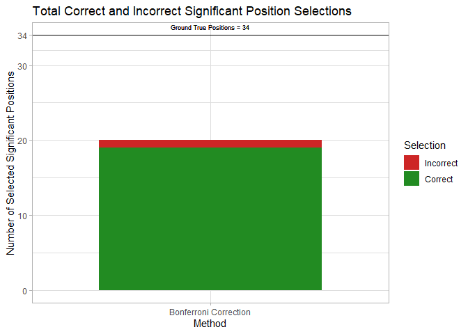

## Analysis of HIV Drug Resistance Data ###
The scientific goal is to determine which mutations of the Human Immunodeficiency Virus Type 1 (HIV-1) are associated with drug resistance. The data set, publicly available from the Stanford HIV Drug Resistance Database <http://hivdb.stanford.edu/pages/published_analysis/genophenoPNAS2006/>, was originally analyzed in (Rhee et al. 2006). 

### Preparing the Data ###
The data set consists of measurements for three classes of drugs: protease inhibitors (PIs), nucleoside reverse transcriptase (RT) inhibitors (NRTIs), and nonnucleoside RT inhibitors (NNRTIs). Protease and reverse transcriptase are two enzymes in HIV-1 that are crucial to the function of the virus. This data set seeks associations between mutations in the HIV-1 protease and drug resistance to different PI type drugs, and between mutations in the HIV-1 reverse transcriptase and drug resistance to different NRTI and NNRTI type drugs (The raw data are saved as `gene_df`).

In order to evaluate our results, we compare with the treatment-selected mutation panels created by (Rhee et al. 2005), which can be viewed as the ground true. These panels give lists of HIV-1 mutations appearing more frequently in patients who have previously been treated with PI, NRTI, or NNRTI type drugs, than in patients with no previous exposure to that drug type. Increased frequency of a mutation among patients treated with a certain drug type implies that the mutation confers resistance to that drug type (The raw data are saved as `tsm_df`).

To simplify the analysis, in this project we will confine our attention to the PI drugs.

``` r
drug_class = 'PI' # Possible drug types are 'PI', 'NRTI', and 'NNRTI'. 
```

### Fetching and Cleaning the Data ##
First, we download the data and read it into data frames.


``` r
base_url = 'https://hivdb.stanford.edu/_wrapper/pages/published_analysis/genophenoPNAS2006'
gene_url = paste(base_url, 'DATA', paste0(drug_class, '_DATA.txt'), sep='/')
tsm_url = paste(base_url, 'MUTATIONLISTS', 'NP_TSM', drug_class, sep='/')

gene_df = read.delim(gene_url, na.string = c('NA', ''), stringsAsFactors = FALSE)
tsm_df = read.delim(tsm_url, header = FALSE, stringsAsFactors = FALSE)
names(tsm_df) = c('Position', 'Mutations')
```

A small sample of the data is shown below.

``` r
head(gene_df, n=6)
```

```
##   IsolateName PseudoName MedlineID  APV  ATV   IDV   LPV   NFV   RTV   SQV P1
## 1     CA10676      CA622  10839657  2.3   NA  32.7    NA  23.4  51.6  37.8  -
## 2     CA37880      CA622  15995959 76.0   NA 131.0 200.0  50.0 200.0 156.0  -
## 3      CA9984      CA624  11897594  2.8   NA  12.0    NA 100.0  41.0 145.6  -
## 4     CA17003      CA628  15995959  6.5  9.2   2.1   5.3   5.0  36.0  13.0  -
## 5     CA10670      CA634  10839657  8.3   NA 100.0    NA 161.1 170.2 100.0  -
## 6     CA42683      CA634  15995959 82.0 75.0 400.0 400.0  91.0 400.0 400.0  -
##   P2 P3 P4 P5 P6 P7 P8 P9 P10 P11 P12 P13 P14 P15 P16 P17 P18 P19 P20 P21 P22
## 1  -  -  -  -  -  -  -  -   I   -   -   -   -   -   -   -   -   -   -   -   -
## 2  -  -  -  -  -  -  -  -   F   L   -   -   -   -   A   -   -   I   -   -   -
## 3  -  -  -  -  -  -  -  -   -   -   -   V   -   -   -   -   -   -   R   -   -
## 4  -  -  -  -  -  -  -  -   I   -   -   -   -   -   -   -   -   -   -   -   -
## 5  -  -  -  -  -  -  -  -   I   -   -   -   -   -   -   -   -   -   R   -   -
## 6  -  -  -  -  -  -  -  -   I   -   -   -   -   -   -   -   -   -   R   -   -
##   P23 P24 P25 P26 P27 P28 P29 P30 P31 P32 P33 P34 P35 P36 P37 P38 P39 P40 P41
## 1   -   -   -   -   -   -   -   -   -   -   -   -   -   -  DN   -   -   -   K
## 2   -   -   -   -   -   -   -   -   -   -   F   -   -   -   -   -   -   -   K
## 3   -   -   -   -   -   -   -   N   -   -  IL   -   D   I   -   -   -   -   -
## 4   I   -   -   -   -   -   -   -   -   -   -   -   -   -   -   -   -   -   -
## 5   F   -   -   -   -   -   -   -   -   -   -   -   D   I   D   -   -   -   -
## 6   -   -   -   -   -   -   -   -   -   -   F   T   D   I   D   -   -   -   -
##   P42 P43 P44 P45 P46 P47 P48 P49 P50 P51 P52 P53 P54 P55 P56 P57 P58 P59 P60
## 1   -   -   -  RK   I   -   -   -   -   -   -   -   -   -   -   -   -   -   -
## 2   -   -   -   -   I   -   -   -   -   -   -   -   V   -   -   -   -   -   -
## 3   -   -   -   -   -   -   -   -   -   -   -   -   V   -   -   -   -   -   -
## 4   -   -   -   -   L   -   -   -   -   -   -   -   -   -   -   -   E   -   E
## 5   -   -   -   -   I   -   V   -   -   -   -   -   T   -   -   -   -   -   -
## 6   -   T   -   -   I   -   V   -   V   -   -   -   S   -   -   -   -   -   -
##   P61 P62 P63 P64 P65 P66 P67 P68 P69 P70 P71 P72 P73 P74 P75 P76 P77 P78 P79
## 1   -   -   P   -   -   -   -   -   -   -  LV   -   S   -   -   -   I   -   -
## 2   -   -   P   -   -   -   -   -   -   -   V   -   S   -   -   -   -   -   -
## 3   -   -   P   -   -   -   -   -   -   -  TA   -   -   -   -   -   -   -   -
## 4  EK   -   P   -   -   -   -   -   -   -   T   T   -   -   -   -   -   -   -
## 5   -   V   P   -   -   -   -   -   -   -   V   X   -   -   -   -   I   -   -
## 6   -   V   P   -   -   -   -   -   -   -   V   V   -   -   -   -   I   -   -
##   P80 P81 P82 P83 P84 P85 P86 P87 P88 P89 P90 P91 P92 P93 P94 P95 P96 P97 P98
## 1   -   -   T   -   V   V   -   -   -   -   M   -   -   L   -   -   -   -   -
## 2   -   -   T   -   V   -   -   -   -   V   M   S   -   L   -   -   -   -   -
## 3   -   -   -   -   -   -   -   -   D   -   M   -   -   -   -   -   -   -   -
## 4   -   -   A   -   V   -   -   -   -   -   M   -   -   -   -   -   -   -   -
## 5   -   -   A   -   -   -   -   -   -   -   -   -   -   L   -   -   -   -   -
## 6   -   -   A   -   -   V   -   -   -   -   -   -   -   L   -   -   -   -   -
##   P99
## 1   -
## 2   -
## 3   .
## 4   -
## 5   -
## 6   -
```


``` r
head(tsm_df, n=6)
```

```
##   Position Mutations
## 1       10       F R
## 2       11         I
## 3       20     I T V
## 4       23         I
## 5       24         I
## 6       30         N
```
In `tsm_df`, the variable `Position` denotes the position of the mutations that are associated with drug-resistance, while `Mutations` indicating the mutation type.

The gene data table has some rows with error flags or nonstandard mutation codes. For simplicity, we remove all such rows.

``` r
# Returns rows for which every column matches the given regular expression.
grepl_rows <- function(pattern, df) {
  cell_matches = apply(df, c(1,2), function(x) grepl(pattern, x))
  apply(cell_matches, 1, all)
}

pos_start = which(names(gene_df) == 'P1')
pos_cols = seq.int(pos_start, ncol(gene_df))
valid_rows = grepl_rows('^(\\.|-|[A-Zid]+)$', gene_df[,pos_cols])
gene_df = gene_df[valid_rows,]
```

### Preparing the Regression Matrix ##
We now construct the design matrix $X$ and matrix of response vectors $Y$. The features (columns of $X$) are given by mutation/position pairs. Define

$$
X_{i,j} = 1 \text{ if the } i \text{th patient has the } j \text{th mutation/position pair and 0 otherwise} \\
Y_{i,k} = \text{resistance of patient } i \text{ to drug } k. 
$$

For example, in the sample for PI type drugs, three different mutations (A, C, and D) are observed at position 63 in the protease, and so three columns of $X$ (named P63.A, P63.C, and P63.D) indicate the presence or absence of each mutation at this position.

``` r
# Flatten a matrix to a vector with names from concatenating row/column names.
flatten_matrix <- function(M, sep='.') {
  x <- c(M)
  names(x) <- c(outer(rownames(M), colnames(M),
                      function(...) paste(..., sep=sep)))
  x
}

# Construct preliminary design matrix.
muts = c(LETTERS, 'i', 'd')
X = outer(muts, as.matrix(gene_df[,pos_cols]), Vectorize(grepl))
X = aperm(X, c(2,3,1))
dimnames(X)[[3]] <- muts
X = t(apply(X, 1, flatten_matrix))
mode(X) <- 'numeric'

# Remove any mutation/position pairs that never appear in the data.
X = X[,colSums(X) != 0]

# Extract response matrix.
Y = gene_df[,4:(pos_start-1)]
```

An excerpt of the design matrix is shown below. By construction, every column contains at least one 1, but the matrix is still quite sparse with the relative frequency of 1’s being about 0.025.

``` r
library(DT)
datatable(data.frame(X)[1:10, ], options = list(scrollX=T, pageLength = 10))
```

```{=html}
<div class="datatables html-widget html-fill-item" id="htmlwidget-8939ee04ff45a2350c2d" style="width:100%;height:auto;"></div>
<script type="application/json" data-for="htmlwidget-8939ee04ff45a2350c2d">{"x":{"filter":"none","vertical":false,"data":[["1","2","3","4","5","6","7","8","9","10"],[0,0,0,0,0,0,0,0,0,0],[0,0,0,0,0,0,0,0,0,0],[0,0,0,0,0,0,0,0,0,0],[0,1,0,0,0,0,0,0,1,0],[0,0,0,0,0,0,0,0,0,0],[0,0,0,0,0,0,0,0,0,0],[0,0,0,0,0,0,0,0,0,0],[0,0,0,0,0,0,0,1,0,0],[0,0,0,0,0,0,0,0,0,0],[0,0,0,0,0,0,0,0,0,0],[0,0,0,0,0,0,0,0,0,0],[0,0,1,0,0,0,0,0,0,0],[0,0,0,0,0,0,0,0,0,0],[0,0,0,0,0,0,0,0,0,0],[0,0,0,0,0,0,0,0,0,0],[0,0,0,1,1,1,1,0,0,1],[0,0,0,0,0,0,0,0,0,0],[0,0,0,0,0,0,0,0,0,0],[0,0,0,0,0,0,0,0,0,0],[0,0,0,0,0,0,0,0,0,0],[0,0,0,0,0,0,0,0,0,0],[0,0,0,0,0,0,0,0,0,0],[0,0,0,0,0,0,0,0,0,0],[0,0,0,0,0,0,0,0,0,0],[0,0,0,0,0,0,0,0,0,0],[0,0,0,0,0,0,0,0,0,0],[0,0,0,0,0,0,0,0,0,0],[0,0,0,0,0,0,0,0,0,0],[0,0,0,0,0,0,0,0,0,0],[0,0,0,0,0,0,0,0,0,0],[0,0,1,0,1,1,0,0,0,0],[1,0,0,0,1,1,1,0,0,0],[0,0,0,0,0,0,0,0,0,0],[0,0,0,0,0,0,0,0,0,0],[0,0,0,0,0,0,0,0,0,0],[0,0,0,0,0,0,0,0,0,0],[0,0,0,0,0,0,0,0,0,0],[0,0,0,0,0,0,0,0,0,0],[0,0,0,0,0,0,0,0,1,0],[0,0,0,0,0,0,0,0,0,0],[0,0,1,0,0,0,0,0,0,0],[0,0,0,0,0,0,0,0,0,0],[0,0,0,0,0,0,0,0,0,0],[0,0,0,0,0,0,0,0,0,0],[0,0,0,0,0,0,0,0,0,0],[0,0,0,0,0,0,1,0,0,0],[0,0,0,0,0,0,0,0,0,0],[0,0,0,0,0,0,0,0,0,0],[0,0,0,0,0,0,0,0,0,0],[0,0,0,0,0,0,0,0,0,0],[0,0,0,0,0,0,0,0,0,0],[0,0,0,0,0,0,0,0,0,0],[0,0,0,0,0,0,0,0,0,0],[0,0,0,1,0,0,0,0,0,0],[0,0,0,1,0,0,0,0,0,1],[0,0,0,1,0,0,0,0,0,0],[0,0,0,0,0,0,0,0,0,0],[0,0,0,0,0,0,0,0,0,0],[0,0,0,0,0,0,0,0,0,0],[0,0,0,0,0,0,0,0,0,0],[0,0,0,0,0,0,0,1,0,0],[0,0,0,0,0,0,0,0,0,0],[0,0,0,0,0,0,0,0,0,0],[0,1,0,0,0,0,0,0,1,0],[0,0,0,0,0,0,0,0,0,0],[0,0,0,0,1,0,0,0,0,0],[0,0,0,0,0,0,0,0,0,0],[0,1,0,0,0,1,0,0,1,0],[0,0,0,0,0,0,0,0,0,0],[0,0,0,0,0,0,0,0,0,0],[0,0,0,0,0,0,0,0,0,0],[0,0,0,0,0,0,0,0,0,0],[0,0,0,0,0,0,0,0,0,0],[0,0,0,0,0,0,0,0,0,0],[0,0,0,0,0,0,0,0,0,0],[0,0,0,0,0,0,0,0,0,0],[0,0,0,0,0,0,0,0,0,0],[0,0,0,0,0,0,0,0,0,0],[0,0,0,0,0,0,0,0,0,0],[0,0,0,0,0,0,0,0,0,0],[0,0,0,0,0,0,0,0,0,0],[0,0,0,0,0,0,0,0,0,0],[0,0,0,0,0,0,0,0,0,0],[0,0,0,0,0,0,0,0,0,0],[0,0,0,0,0,0,0,0,0,0],[0,0,0,0,0,0,0,0,0,0],[0,0,0,0,0,0,0,0,0,0],[0,0,0,0,0,0,0,0,0,0],[0,0,0,0,0,0,0,0,0,0],[0,0,0,0,0,0,0,0,0,0],[0,0,0,0,0,0,0,0,0,0],[0,0,0,0,0,0,0,1,0,0],[0,0,0,0,0,0,0,0,0,0],[0,0,0,0,0,0,0,0,0,0],[0,0,0,0,0,0,0,0,0,0],[0,0,0,0,0,0,0,0,0,0],[1,0,0,1,1,1,1,0,0,1],[0,0,0,0,0,0,0,0,0,0],[0,0,0,0,0,0,0,0,0,0],[0,0,0,0,0,0,0,0,0,0],[0,0,0,0,0,0,0,0,0,0],[0,0,0,0,0,0,0,0,0,0],[0,0,0,0,0,0,0,0,0,0],[0,1,0,0,0,0,0,1,1,0],[0,0,0,0,0,0,0,0,0,1],[0,0,0,1,0,0,0,0,0,0],[0,0,0,0,0,0,0,0,1,0],[0,0,0,0,0,0,0,0,0,0],[0,0,1,0,0,0,0,0,0,0],[0,0,1,0,1,1,0,0,0,0],[0,0,0,0,0,0,0,0,0,0],[0,0,0,0,0,0,0,0,0,0],[0,0,0,0,0,0,0,0,0,0],[1,1,0,0,1,1,0,0,1,0],[0,0,0,0,0,0,0,0,0,0],[0,0,0,0,0,0,0,0,0,0],[0,0,0,0,0,0,0,0,0,0],[0,0,0,0,0,0,0,0,0,0],[0,0,0,0,0,0,0,0,0,0],[0,0,0,0,0,0,0,0,0,0],[0,0,0,0,0,0,0,0,0,0],[1,0,0,0,1,1,1,0,0,0],[0,0,0,0,0,0,0,0,0,0],[0,0,0,0,0,0,0,0,0,0],[0,0,0,0,0,0,0,0,0,0],[0,0,0,0,0,0,0,0,0,0],[0,0,0,0,0,0,0,0,0,0],[0,0,0,0,0,0,0,0,0,0],[0,0,0,0,0,0,0,0,0,1],[0,0,0,0,0,0,0,0,0,0],[1,1,0,0,0,0,0,0,0,0],[0,0,0,0,0,0,0,0,0,0],[1,0,0,0,0,0,0,0,0,0],[0,0,0,0,0,0,0,0,0,0],[0,0,0,0,0,0,0,0,0,0],[0,0,0,1,0,0,0,0,0,0],[0,0,0,0,0,0,0,0,0,0],[0,0,0,0,0,0,0,0,0,0],[0,0,0,0,0,0,0,0,0,0],[0,0,0,0,0,0,0,0,0,0],[0,0,0,0,0,0,0,0,0,0],[0,0,0,0,0,0,0,1,0,0],[0,0,0,0,0,0,0,0,0,0],[0,0,0,0,0,0,0,0,0,0],[0,1,0,0,0,0,0,0,0,0],[0,0,0,0,0,0,0,0,0,0],[0,0,0,0,0,0,0,0,0,0],[0,0,0,0,0,0,0,0,0,0],[0,0,0,0,0,0,0,0,1,0],[0,0,0,0,0,0,0,0,0,0],[0,0,0,0,0,0,0,0,0,0],[0,0,1,0,0,0,0,0,0,0],[0,0,0,0,0,0,0,0,0,0],[0,0,0,0,0,0,0,0,0,0],[0,0,0,0,0,0,0,0,0,0],[0,0,0,1,0,0,0,0,0,1],[0,0,0,0,0,0,0,0,0,0],[0,0,0,0,0,0,0,0,0,0],[0,0,0,0,0,0,0,0,0,0],[0,0,0,0,0,0,0,0,0,0],[0,0,0,0,0,0,0,0,0,0],[0,0,0,0,0,0,0,0,0,0],[0,0,0,0,0,0,0,0,0,0],[1,0,0,0,0,0,0,0,0,0],[0,0,0,0,0,0,0,0,0,0],[0,0,0,0,0,0,0,0,0,0],[0,0,0,0,0,0,0,0,0,0],[0,0,0,0,0,0,0,0,0,0],[0,0,0,0,0,0,0,0,0,0],[1,1,0,0,1,1,1,0,1,0],[0,0,0,0,0,0,0,0,0,0],[0,0,0,0,0,0,0,0,0,0],[0,0,0,0,0,0,0,0,0,0],[0,0,0,0,0,0,0,0,0,0],[0,0,0,0,0,0,0,0,0,0],[0,0,0,0,0,0,0,0,0,0],[0,0,0,0,0,0,0,0,0,0],[0,0,0,0,0,0,0,0,0,0],[0,0,0,0,0,0,0,0,0,0],[0,0,0,0,0,0,0,0,0,0],[0,0,0,0,0,0,0,0,0,0],[0,0,0,0,0,0,0,0,0,0],[0,0,0,0,0,0,0,0,0,0],[0,0,0,0,0,0,0,0,0,0],[0,0,0,0,0,0,0,0,0,0],[0,0,0,0,0,0,0,0,0,0],[1,1,1,1,0,0,0,0,0,1],[0,0,0,0,0,0,0,0,0,0],[0,0,0,0,0,0,0,0,0,0],[0,0,0,0,0,0,0,0,0,0],[0,0,1,0,0,0,0,0,0,0],[0,0,0,0,0,0,0,0,0,0],[0,0,0,0,0,0,0,0,0,0],[1,0,0,0,0,0,0,0,0,0],[0,0,0,0,0,0,0,0,0,0],[0,0,0,0,0,0,0,0,0,0],[0,0,0,0,0,0,0,0,0,0],[0,0,0,0,0,0,0,0,0,0],[0,0,0,0,0,0,0,0,0,0],[0,0,0,0,0,0,0,0,0,0],[0,0,0,0,0,0,0,0,0,0],[0,0,0,0,0,0,0,0,0,0],[0,0,0,0,0,0,0,0,0,0],[0,0,0,0,0,0,0,0,0,0],[0,0,0,0,0,0,0,0,0,0],[0,0,0,0,0,0,0,0,0,0],[0,0,0,0,0,0,0,0,0,0],[0,0,0,0,0,0,0,0,0,0],[0,0,0,0,0,0,0,0,0,0],[0,0,0,0,0,0,0,0,0,0],[0,0,0,0,0,0,0,0,0,0],[0,0,0,0,0,0,0,0,0,0],[0,0,0,0,0,0,0,0,0,0],[0,0,0,0,0,0,0,0,0,0],[1,1,1,1,1,1,1,0,1,1],[0,0,0,0,0,0,0,0,0,0],[0,0,0,0,0,0,0,0,0,0],[0,0,0,0,0,0,0,0,0,0],[0,0,0,0,0,0,0,0,0,0],[0,0,0,0,0,0,0,0,0,0],[0,0,0,0,0,0,0,0,0,0],[0,0,0,0,0,0,0,0,0,0],[0,0,0,0,0,0,0,0,0,0],[0,0,0,0,0,0,0,0,0,0],[0,0,0,0,0,0,0,0,0,0],[0,0,0,0,0,0,0,0,0,0],[0,0,0,0,0,0,0,0,0,0],[0,0,0,0,0,0,0,0,0,0],[0,0,0,0,0,0,0,0,0,0],[0,0,0,0,0,0,0,0,0,0],[0,0,0,0,0,0,0,0,0,0],[0,0,0,0,0,0,0,0,0,0],[0,0,0,0,0,0,0,0,0,0],[0,0,0,0,0,0,0,0,0,0],[0,0,0,0,0,0,0,0,0,0],[0,0,0,0,0,0,0,0,0,0],[0,0,0,0,0,0,0,0,0,0],[0,0,0,0,0,0,0,0,0,0],[0,0,0,0,0,0,0,0,0,0],[0,0,0,0,0,0,0,0,0,0],[0,0,0,0,0,0,0,0,0,0],[0,0,0,0,0,0,0,0,0,0],[0,0,1,0,1,1,0,0,0,0],[0,0,0,0,0,0,0,0,0,0],[0,0,0,0,0,0,0,0,0,0],[1,0,0,0,0,0,0,0,0,0],[0,0,0,0,0,0,0,0,0,0],[0,0,0,0,0,0,0,0,0,0],[0,0,0,0,0,0,0,0,0,0],[0,0,0,0,0,0,0,0,0,0],[0,0,0,0,0,0,0,0,0,0],[0,0,0,0,0,0,0,0,0,0],[0,0,0,0,0,0,0,0,0,0],[0,0,0,0,0,0,0,0,0,0],[0,0,0,0,0,0,0,0,0,0],[0,0,0,0,0,0,0,0,0,0],[0,0,0,0,0,0,0,0,0,0],[0,0,0,0,0,0,0,0,0,0],[0,0,0,0,0,0,0,0,0,0],[0,0,0,0,0,0,0,0,0,0],[0,0,0,0,0,0,0,0,0,0],[0,0,0,0,0,0,0,0,0,0],[0,0,0,0,0,1,0,0,0,0],[0,0,0,0,0,0,0,0,0,0],[0,0,0,0,0,0,1,0,0,0],[0,0,0,0,0,0,0,0,0,0],[1,1,0,0,0,0,0,0,0,0],[0,0,0,0,0,0,0,0,0,0],[0,0,0,0,0,0,0,0,0,0],[0,0,0,0,0,0,0,0,0,0],[0,0,0,0,0,0,0,0,0,0],[0,1,0,0,0,0,0,0,0,0],[0,0,0,0,0,0,0,0,0,0],[0,0,0,0,0,0,0,0,0,0],[0,0,0,0,0,0,0,0,0,0],[0,0,0,0,0,0,0,0,0,0],[0,0,0,0,0,0,0,0,0,0],[0,0,0,0,0,0,0,0,0,0],[0,0,0,0,0,0,0,0,0,0],[0,0,0,0,0,0,0,0,0,0],[0,0,0,0,0,1,0,0,0,0],[0,0,0,0,0,0,0,0,0,0],[0,0,0,0,0,1,1,0,0,0],[0,0,0,0,1,0,0,0,0,0],[0,0,0,0,0,0,0,0,0,0],[0,0,0,0,0,0,0,0,0,0],[0,0,0,0,0,0,0,0,0,0],[0,0,1,1,0,0,0,0,0,0],[0,0,0,1,0,0,0,0,0,0],[0,0,0,0,0,0,0,0,1,0],[0,0,0,0,0,0,0,0,0,0],[0,0,0,0,0,0,0,0,0,0],[1,1,0,0,0,0,0,0,0,0],[0,0,0,0,0,0,0,0,0,0],[0,0,0,0,0,0,0,0,0,0],[0,0,0,0,0,0,0,0,0,0],[0,0,0,0,0,0,0,0,0,0],[0,0,0,0,0,0,0,0,0,0],[0,0,0,0,0,0,0,0,0,0],[0,0,0,0,0,0,0,0,0,0],[0,0,0,0,0,0,0,0,0,0],[0,0,1,0,0,0,0,0,1,0],[0,0,0,0,0,0,0,0,0,0],[0,0,0,0,0,0,0,1,0,0],[0,0,0,0,0,0,0,0,0,0],[0,0,0,0,0,0,0,0,0,0],[0,0,0,0,0,0,0,0,0,0],[0,0,0,0,0,0,0,0,0,0],[0,0,0,0,0,0,0,1,0,0],[0,0,0,0,0,0,0,0,0,0],[0,0,0,0,0,0,0,0,0,0],[0,0,0,0,0,0,0,0,0,0],[0,0,0,0,0,0,0,0,0,0],[0,0,0,0,0,0,0,0,0,0],[0,0,0,0,0,0,0,0,0,0],[0,0,0,0,1,1,1,0,0,0],[0,0,0,0,0,1,0,0,0,0],[0,1,1,0,0,0,1,0,1,1],[0,0,0,0,1,1,0,0,0,1],[0,0,0,0,0,0,0,0,0,0],[0,0,0,0,0,0,0,1,0,0],[0,0,0,0,0,0,0,0,1,0],[1,1,0,0,1,1,1,0,0,1],[0,0,0,0,0,1,0,0,1,0],[0,0,0,0,0,0,0,0,0,0],[0,0,0,0,0,0,0,0,0,0],[0,0,0,0,0,0,0,0,0,0],[1,1,0,1,0,0,1,0,1,1],[1,0,0,0,0,1,0,0,0,0],[0,1,0,0,0,0,0,0,0,0],[0,0,0,0,0,0,0,0,0,0],[0,0,0,0,0,0,0,0,0,0],[0,0,0,0,0,0,0,0,0,0],[0,0,0,0,0,0,0,0,0,0],[0,0,0,0,0,0,0,0,0,0],[0,0,0,0,0,0,0,0,0,0],[0,0,0,0,0,0,0,0,0,0],[0,0,0,0,0,0,0,0,0,0],[0,0,0,0,0,0,0,0,0,0],[0,0,0,0,0,0,0,0,0,0],[0,0,0,0,0,0,0,0,0,0],[0,0,0,0,0,0,0,0,0,0],[0,0,0,0,1,0,0,0,0,0],[0,0,0,0,0,0,0,0,0,0],[0,0,0,0,0,0,0,0,0,0],[0,0,0,0,0,0,0,0,0,0],[0,0,0,0,0,0,0,0,0,0],[0,0,0,0,0,0,0,0,0,0],[0,0,0,0,0,0,0,0,0,0],[0,0,0,0,0,0,0,0,0,0],[0,0,0,0,0,0,0,0,0,0],[0,0,0,0,0,0,0,0,0,0],[0,0,0,0,0,0,0,0,0,0],[0,0,0,0,0,0,0,0,0,0],[0,0,0,0,0,0,0,0,0,0],[0,0,0,0,0,0,0,0,0,0],[0,0,0,0,0,0,0,0,0,0],[0,0,0,0,0,0,0,0,0,0],[0,0,0,0,0,0,0,0,0,0],[0,0,0,0,0,0,0,0,0,0],[0,0,0,0,0,0,0,0,0,0]],"container":"<table class=\"display\">\n  <thead>\n    <tr>\n      <th> <\/th>\n      <th>P4.A<\/th>\n      <th>P12.A<\/th>\n      <th>P13.A<\/th>\n      <th>P16.A<\/th>\n      <th>P20.A<\/th>\n      <th>P22.A<\/th>\n      <th>P28.A<\/th>\n      <th>P37.A<\/th>\n      <th>P51.A<\/th>\n      <th>P54.A<\/th>\n      <th>P63.A<\/th>\n      <th>P71.A<\/th>\n      <th>P73.A<\/th>\n      <th>P74.A<\/th>\n      <th>P79.A<\/th>\n      <th>P82.A<\/th>\n      <th>P84.A<\/th>\n      <th>P91.A<\/th>\n      <th>P37.C<\/th>\n      <th>P63.C<\/th>\n      <th>P67.C<\/th>\n      <th>P73.C<\/th>\n      <th>P82.C<\/th>\n      <th>P84.C<\/th>\n      <th>P91.C<\/th>\n      <th>P95.C<\/th>\n      <th>P4.D<\/th>\n      <th>P12.D<\/th>\n      <th>P25.D<\/th>\n      <th>P34.D<\/th>\n      <th>P35.D<\/th>\n      <th>P37.D<\/th>\n      <th>P60.D<\/th>\n      <th>P61.D<\/th>\n      <th>P63.D<\/th>\n      <th>P65.D<\/th>\n      <th>P68.D<\/th>\n      <th>P69.D<\/th>\n      <th>P79.D<\/th>\n      <th>P83.D<\/th>\n      <th>P88.D<\/th>\n      <th>P98.D<\/th>\n      <th>P7.E<\/th>\n      <th>P12.E<\/th>\n      <th>P16.E<\/th>\n      <th>P17.E<\/th>\n      <th>P18.E<\/th>\n      <th>P20.E<\/th>\n      <th>P21.E<\/th>\n      <th>P34.E<\/th>\n      <th>P35.E<\/th>\n      <th>P37.E<\/th>\n      <th>P47.E<\/th>\n      <th>P58.E<\/th>\n      <th>P60.E<\/th>\n      <th>P61.E<\/th>\n      <th>P63.E<\/th>\n      <th>P65.E<\/th>\n      <th>P67.E<\/th>\n      <th>P68.E<\/th>\n      <th>P70.E<\/th>\n      <th>P72.E<\/th>\n      <th>P92.E<\/th>\n      <th>P10.F<\/th>\n      <th>P19.F<\/th>\n      <th>P23.F<\/th>\n      <th>P24.F<\/th>\n      <th>P33.F<\/th>\n      <th>P38.F<\/th>\n      <th>P59.F<\/th>\n      <th>P63.F<\/th>\n      <th>P66.F<\/th>\n      <th>P67.F<\/th>\n      <th>P82.F<\/th>\n      <th>P95.F<\/th>\n      <th>P8.G<\/th>\n      <th>P16.G<\/th>\n      <th>P21.G<\/th>\n      <th>P35.G<\/th>\n      <th>P37.G<\/th>\n      <th>P52.G<\/th>\n      <th>P57.G<\/th>\n      <th>P61.G<\/th>\n      <th>P67.G<\/th>\n      <th>P77.G<\/th>\n      <th>P88.G<\/th>\n      <th>P7.H<\/th>\n      <th>P10.H<\/th>\n      <th>P18.H<\/th>\n      <th>P37.H<\/th>\n      <th>P61.H<\/th>\n      <th>P63.H<\/th>\n      <th>P69.H<\/th>\n      <th>P79.H<\/th>\n      <th>P92.H<\/th>\n      <th>P3.I<\/th>\n      <th>P10.I<\/th>\n      <th>P11.I<\/th>\n      <th>P12.I<\/th>\n      <th>P13.I<\/th>\n      <th>P14.I<\/th>\n      <th>P15.I<\/th>\n      <th>P18.I<\/th>\n      <th>P19.I<\/th>\n      <th>P20.I<\/th>\n      <th>P23.I<\/th>\n      <th>P24.I<\/th>\n      <th>P32.I<\/th>\n      <th>P33.I<\/th>\n      <th>P36.I<\/th>\n      <th>P37.I<\/th>\n      <th>P38.I<\/th>\n      <th>P41.I<\/th>\n      <th>P46.I<\/th>\n      <th>P53.I<\/th>\n      <th>P62.I<\/th>\n      <th>P64.I<\/th>\n      <th>P66.I<\/th>\n      <th>P71.I<\/th>\n      <th>P72.I<\/th>\n      <th>P75.I<\/th>\n      <th>P77.I<\/th>\n      <th>P82.I<\/th>\n      <th>P85.I<\/th>\n      <th>P89.I<\/th>\n      <th>P93.I<\/th>\n      <th>P12.K<\/th>\n      <th>P14.K<\/th>\n      <th>P20.K<\/th>\n      <th>P34.K<\/th>\n      <th>P41.K<\/th>\n      <th>P43.K<\/th>\n      <th>P45.K<\/th>\n      <th>P55.K<\/th>\n      <th>P57.K<\/th>\n      <th>P61.K<\/th>\n      <th>P69.K<\/th>\n      <th>P70.K<\/th>\n      <th>P72.K<\/th>\n      <th>P74.K<\/th>\n      <th>P85.K<\/th>\n      <th>P92.K<\/th>\n      <th>P6.L<\/th>\n      <th>P10.L<\/th>\n      <th>P11.L<\/th>\n      <th>P13.L<\/th>\n      <th>P15.L<\/th>\n      <th>P18.L<\/th>\n      <th>P19.L<\/th>\n      <th>P20.L<\/th>\n      <th>P23.L<\/th>\n      <th>P33.L<\/th>\n      <th>P36.L<\/th>\n      <th>P38.L<\/th>\n      <th>P45.L<\/th>\n      <th>P46.L<\/th>\n      <th>P50.L<\/th>\n      <th>P53.L<\/th>\n      <th>P54.L<\/th>\n      <th>P63.L<\/th>\n      <th>P64.L<\/th>\n      <th>P66.L<\/th>\n      <th>P67.L<\/th>\n      <th>P71.L<\/th>\n      <th>P72.L<\/th>\n      <th>P76.L<\/th>\n      <th>P82.L<\/th>\n      <th>P85.L<\/th>\n      <th>P89.L<\/th>\n      <th>P93.L<\/th>\n      <th>P95.L<\/th>\n      <th>P10.M<\/th>\n      <th>P14.M<\/th>\n      <th>P15.M<\/th>\n      <th>P19.M<\/th>\n      <th>P20.M<\/th>\n      <th>P33.M<\/th>\n      <th>P36.M<\/th>\n      <th>P38.M<\/th>\n      <th>P48.M<\/th>\n      <th>P54.M<\/th>\n      <th>P64.M<\/th>\n      <th>P72.M<\/th>\n      <th>P77.M<\/th>\n      <th>P85.M<\/th>\n      <th>P89.M<\/th>\n      <th>P90.M<\/th>\n      <th>P93.M<\/th>\n      <th>P12.N<\/th>\n      <th>P20.N<\/th>\n      <th>P30.N<\/th>\n      <th>P34.N<\/th>\n      <th>P35.N<\/th>\n      <th>P37.N<\/th>\n      <th>P43.N<\/th>\n      <th>P45.N<\/th>\n      <th>P55.N<\/th>\n      <th>P60.N<\/th>\n      <th>P61.N<\/th>\n      <th>P66.N<\/th>\n      <th>P69.N<\/th>\n      <th>P70.N<\/th>\n      <th>P79.N<\/th>\n      <th>P85.N<\/th>\n      <th>P98.N<\/th>\n      <th>P4.P<\/th>\n      <th>P9.P<\/th>\n      <th>P12.P<\/th>\n      <th>P19.P<\/th>\n      <th>P26.P<\/th>\n      <th>P28.P<\/th>\n      <th>P37.P<\/th>\n      <th>P39.P<\/th>\n      <th>P41.P<\/th>\n      <th>P63.P<\/th>\n      <th>P69.P<\/th>\n      <th>P74.P<\/th>\n      <th>P79.P<\/th>\n      <th>P89.P<\/th>\n      <th>P7.Q<\/th>\n      <th>P8.Q<\/th>\n      <th>P12.Q<\/th>\n      <th>P18.Q<\/th>\n      <th>P19.Q<\/th>\n      <th>P21.Q<\/th>\n      <th>P34.Q<\/th>\n      <th>P37.Q<\/th>\n      <th>P39.Q<\/th>\n      <th>P45.Q<\/th>\n      <th>P58.Q<\/th>\n      <th>P61.Q<\/th>\n      <th>P63.Q<\/th>\n      <th>P69.Q<\/th>\n      <th>P70.Q<\/th>\n      <th>P92.Q<\/th>\n      <th>P7.R<\/th>\n      <th>P8.R<\/th>\n      <th>P10.R<\/th>\n      <th>P12.R<\/th>\n      <th>P14.R<\/th>\n      <th>P18.R<\/th>\n      <th>P19.R<\/th>\n      <th>P20.R<\/th>\n      <th>P41.R<\/th>\n      <th>P43.R<\/th>\n      <th>P45.R<\/th>\n      <th>P55.R<\/th>\n      <th>P57.R<\/th>\n      <th>P61.R<\/th>\n      <th>P63.R<\/th>\n      <th>P69.R<\/th>\n      <th>P70.R<\/th>\n      <th>P72.R<\/th>\n      <th>P74.R<\/th>\n      <th>P92.R<\/th>\n      <th>P4.S<\/th>\n      <th>P9.S<\/th>\n      <th>P12.S<\/th>\n      <th>P37.S<\/th>\n      <th>P39.S<\/th>\n      <th>P48.S<\/th>\n      <th>P52.S<\/th>\n      <th>P54.S<\/th>\n      <th>P63.S<\/th>\n      <th>P67.S<\/th>\n      <th>P69.S<\/th>\n      <th>P73.S<\/th>\n      <th>P74.S<\/th>\n      <th>P79.S<\/th>\n      <th>P82.S<\/th>\n      <th>P88.S<\/th>\n      <th>P91.S<\/th>\n      <th>P96.S<\/th>\n      <th>P3.T<\/th>\n      <th>P4.T<\/th>\n      <th>P12.T<\/th>\n      <th>P14.T<\/th>\n      <th>P19.T<\/th>\n      <th>P20.T<\/th>\n      <th>P26.T<\/th>\n      <th>P34.T<\/th>\n      <th>P37.T<\/th>\n      <th>P43.T<\/th>\n      <th>P54.T<\/th>\n      <th>P63.T<\/th>\n      <th>P66.T<\/th>\n      <th>P70.T<\/th>\n      <th>P71.T<\/th>\n      <th>P72.T<\/th>\n      <th>P73.T<\/th>\n      <th>P74.T<\/th>\n      <th>P77.T<\/th>\n      <th>P82.T<\/th>\n      <th>P84.T<\/th>\n      <th>P88.T<\/th>\n      <th>P89.T<\/th>\n      <th>P91.T<\/th>\n      <th>P96.T<\/th>\n      <th>P2.V<\/th>\n      <th>P3.V<\/th>\n      <th>P10.V<\/th>\n      <th>P13.V<\/th>\n      <th>P15.V<\/th>\n      <th>P19.V<\/th>\n      <th>P20.V<\/th>\n      <th>P22.V<\/th>\n      <th>P23.V<\/th>\n      <th>P25.V<\/th>\n      <th>P33.V<\/th>\n      <th>P34.V<\/th>\n      <th>P36.V<\/th>\n      <th>P38.V<\/th>\n      <th>P45.V<\/th>\n      <th>P46.V<\/th>\n      <th>P47.V<\/th>\n      <th>P48.V<\/th>\n      <th>P50.V<\/th>\n      <th>P54.V<\/th>\n      <th>P62.V<\/th>\n      <th>P63.V<\/th>\n      <th>P64.V<\/th>\n      <th>P66.V<\/th>\n      <th>P71.V<\/th>\n      <th>P72.V<\/th>\n      <th>P75.V<\/th>\n      <th>P76.V<\/th>\n      <th>P77.V<\/th>\n      <th>P84.V<\/th>\n      <th>P85.V<\/th>\n      <th>P89.V<\/th>\n      <th>P6.W<\/th>\n      <th>P9.X<\/th>\n      <th>P10.X<\/th>\n      <th>P14.X<\/th>\n      <th>P19.X<\/th>\n      <th>P20.X<\/th>\n      <th>P35.X<\/th>\n      <th>P37.X<\/th>\n      <th>P61.X<\/th>\n      <th>P63.X<\/th>\n      <th>P65.X<\/th>\n      <th>P71.X<\/th>\n      <th>P72.X<\/th>\n      <th>P86.X<\/th>\n      <th>P10.Y<\/th>\n      <th>P37.Y<\/th>\n      <th>P59.Y<\/th>\n      <th>P67.Y<\/th>\n      <th>P69.Y<\/th>\n      <th>P12.Z<\/th>\n      <th>P14.Z<\/th>\n      <th>P16.Z<\/th>\n      <th>P18.Z<\/th>\n      <th>P19.Z<\/th>\n      <th>P34.Z<\/th>\n      <th>P37.Z<\/th>\n      <th>P61.Z<\/th>\n      <th>P72.Z<\/th>\n      <th>P79.Z<\/th>\n      <th>P83.Z<\/th>\n      <th>P92.Z<\/th>\n    <\/tr>\n  <\/thead>\n<\/table>","options":{"scrollX":true,"pageLength":10,"columnDefs":[{"className":"dt-right","targets":[1,2,3,4,5,6,7,8,9,10,11,12,13,14,15,16,17,18,19,20,21,22,23,24,25,26,27,28,29,30,31,32,33,34,35,36,37,38,39,40,41,42,43,44,45,46,47,48,49,50,51,52,53,54,55,56,57,58,59,60,61,62,63,64,65,66,67,68,69,70,71,72,73,74,75,76,77,78,79,80,81,82,83,84,85,86,87,88,89,90,91,92,93,94,95,96,97,98,99,100,101,102,103,104,105,106,107,108,109,110,111,112,113,114,115,116,117,118,119,120,121,122,123,124,125,126,127,128,129,130,131,132,133,134,135,136,137,138,139,140,141,142,143,144,145,146,147,148,149,150,151,152,153,154,155,156,157,158,159,160,161,162,163,164,165,166,167,168,169,170,171,172,173,174,175,176,177,178,179,180,181,182,183,184,185,186,187,188,189,190,191,192,193,194,195,196,197,198,199,200,201,202,203,204,205,206,207,208,209,210,211,212,213,214,215,216,217,218,219,220,221,222,223,224,225,226,227,228,229,230,231,232,233,234,235,236,237,238,239,240,241,242,243,244,245,246,247,248,249,250,251,252,253,254,255,256,257,258,259,260,261,262,263,264,265,266,267,268,269,270,271,272,273,274,275,276,277,278,279,280,281,282,283,284,285,286,287,288,289,290,291,292,293,294,295,296,297,298,299,300,301,302,303,304,305,306,307,308,309,310,311,312,313,314,315,316,317,318,319,320,321,322,323,324,325,326,327,328,329,330,331,332,333,334,335,336,337,338,339,340,341,342,343,344,345,346,347,348,349,350,351,352,353,354,355,356,357,358,359,360,361]},{"orderable":false,"targets":0},{"name":" ","targets":0},{"name":"P4.A","targets":1},{"name":"P12.A","targets":2},{"name":"P13.A","targets":3},{"name":"P16.A","targets":4},{"name":"P20.A","targets":5},{"name":"P22.A","targets":6},{"name":"P28.A","targets":7},{"name":"P37.A","targets":8},{"name":"P51.A","targets":9},{"name":"P54.A","targets":10},{"name":"P63.A","targets":11},{"name":"P71.A","targets":12},{"name":"P73.A","targets":13},{"name":"P74.A","targets":14},{"name":"P79.A","targets":15},{"name":"P82.A","targets":16},{"name":"P84.A","targets":17},{"name":"P91.A","targets":18},{"name":"P37.C","targets":19},{"name":"P63.C","targets":20},{"name":"P67.C","targets":21},{"name":"P73.C","targets":22},{"name":"P82.C","targets":23},{"name":"P84.C","targets":24},{"name":"P91.C","targets":25},{"name":"P95.C","targets":26},{"name":"P4.D","targets":27},{"name":"P12.D","targets":28},{"name":"P25.D","targets":29},{"name":"P34.D","targets":30},{"name":"P35.D","targets":31},{"name":"P37.D","targets":32},{"name":"P60.D","targets":33},{"name":"P61.D","targets":34},{"name":"P63.D","targets":35},{"name":"P65.D","targets":36},{"name":"P68.D","targets":37},{"name":"P69.D","targets":38},{"name":"P79.D","targets":39},{"name":"P83.D","targets":40},{"name":"P88.D","targets":41},{"name":"P98.D","targets":42},{"name":"P7.E","targets":43},{"name":"P12.E","targets":44},{"name":"P16.E","targets":45},{"name":"P17.E","targets":46},{"name":"P18.E","targets":47},{"name":"P20.E","targets":48},{"name":"P21.E","targets":49},{"name":"P34.E","targets":50},{"name":"P35.E","targets":51},{"name":"P37.E","targets":52},{"name":"P47.E","targets":53},{"name":"P58.E","targets":54},{"name":"P60.E","targets":55},{"name":"P61.E","targets":56},{"name":"P63.E","targets":57},{"name":"P65.E","targets":58},{"name":"P67.E","targets":59},{"name":"P68.E","targets":60},{"name":"P70.E","targets":61},{"name":"P72.E","targets":62},{"name":"P92.E","targets":63},{"name":"P10.F","targets":64},{"name":"P19.F","targets":65},{"name":"P23.F","targets":66},{"name":"P24.F","targets":67},{"name":"P33.F","targets":68},{"name":"P38.F","targets":69},{"name":"P59.F","targets":70},{"name":"P63.F","targets":71},{"name":"P66.F","targets":72},{"name":"P67.F","targets":73},{"name":"P82.F","targets":74},{"name":"P95.F","targets":75},{"name":"P8.G","targets":76},{"name":"P16.G","targets":77},{"name":"P21.G","targets":78},{"name":"P35.G","targets":79},{"name":"P37.G","targets":80},{"name":"P52.G","targets":81},{"name":"P57.G","targets":82},{"name":"P61.G","targets":83},{"name":"P67.G","targets":84},{"name":"P77.G","targets":85},{"name":"P88.G","targets":86},{"name":"P7.H","targets":87},{"name":"P10.H","targets":88},{"name":"P18.H","targets":89},{"name":"P37.H","targets":90},{"name":"P61.H","targets":91},{"name":"P63.H","targets":92},{"name":"P69.H","targets":93},{"name":"P79.H","targets":94},{"name":"P92.H","targets":95},{"name":"P3.I","targets":96},{"name":"P10.I","targets":97},{"name":"P11.I","targets":98},{"name":"P12.I","targets":99},{"name":"P13.I","targets":100},{"name":"P14.I","targets":101},{"name":"P15.I","targets":102},{"name":"P18.I","targets":103},{"name":"P19.I","targets":104},{"name":"P20.I","targets":105},{"name":"P23.I","targets":106},{"name":"P24.I","targets":107},{"name":"P32.I","targets":108},{"name":"P33.I","targets":109},{"name":"P36.I","targets":110},{"name":"P37.I","targets":111},{"name":"P38.I","targets":112},{"name":"P41.I","targets":113},{"name":"P46.I","targets":114},{"name":"P53.I","targets":115},{"name":"P62.I","targets":116},{"name":"P64.I","targets":117},{"name":"P66.I","targets":118},{"name":"P71.I","targets":119},{"name":"P72.I","targets":120},{"name":"P75.I","targets":121},{"name":"P77.I","targets":122},{"name":"P82.I","targets":123},{"name":"P85.I","targets":124},{"name":"P89.I","targets":125},{"name":"P93.I","targets":126},{"name":"P12.K","targets":127},{"name":"P14.K","targets":128},{"name":"P20.K","targets":129},{"name":"P34.K","targets":130},{"name":"P41.K","targets":131},{"name":"P43.K","targets":132},{"name":"P45.K","targets":133},{"name":"P55.K","targets":134},{"name":"P57.K","targets":135},{"name":"P61.K","targets":136},{"name":"P69.K","targets":137},{"name":"P70.K","targets":138},{"name":"P72.K","targets":139},{"name":"P74.K","targets":140},{"name":"P85.K","targets":141},{"name":"P92.K","targets":142},{"name":"P6.L","targets":143},{"name":"P10.L","targets":144},{"name":"P11.L","targets":145},{"name":"P13.L","targets":146},{"name":"P15.L","targets":147},{"name":"P18.L","targets":148},{"name":"P19.L","targets":149},{"name":"P20.L","targets":150},{"name":"P23.L","targets":151},{"name":"P33.L","targets":152},{"name":"P36.L","targets":153},{"name":"P38.L","targets":154},{"name":"P45.L","targets":155},{"name":"P46.L","targets":156},{"name":"P50.L","targets":157},{"name":"P53.L","targets":158},{"name":"P54.L","targets":159},{"name":"P63.L","targets":160},{"name":"P64.L","targets":161},{"name":"P66.L","targets":162},{"name":"P67.L","targets":163},{"name":"P71.L","targets":164},{"name":"P72.L","targets":165},{"name":"P76.L","targets":166},{"name":"P82.L","targets":167},{"name":"P85.L","targets":168},{"name":"P89.L","targets":169},{"name":"P93.L","targets":170},{"name":"P95.L","targets":171},{"name":"P10.M","targets":172},{"name":"P14.M","targets":173},{"name":"P15.M","targets":174},{"name":"P19.M","targets":175},{"name":"P20.M","targets":176},{"name":"P33.M","targets":177},{"name":"P36.M","targets":178},{"name":"P38.M","targets":179},{"name":"P48.M","targets":180},{"name":"P54.M","targets":181},{"name":"P64.M","targets":182},{"name":"P72.M","targets":183},{"name":"P77.M","targets":184},{"name":"P85.M","targets":185},{"name":"P89.M","targets":186},{"name":"P90.M","targets":187},{"name":"P93.M","targets":188},{"name":"P12.N","targets":189},{"name":"P20.N","targets":190},{"name":"P30.N","targets":191},{"name":"P34.N","targets":192},{"name":"P35.N","targets":193},{"name":"P37.N","targets":194},{"name":"P43.N","targets":195},{"name":"P45.N","targets":196},{"name":"P55.N","targets":197},{"name":"P60.N","targets":198},{"name":"P61.N","targets":199},{"name":"P66.N","targets":200},{"name":"P69.N","targets":201},{"name":"P70.N","targets":202},{"name":"P79.N","targets":203},{"name":"P85.N","targets":204},{"name":"P98.N","targets":205},{"name":"P4.P","targets":206},{"name":"P9.P","targets":207},{"name":"P12.P","targets":208},{"name":"P19.P","targets":209},{"name":"P26.P","targets":210},{"name":"P28.P","targets":211},{"name":"P37.P","targets":212},{"name":"P39.P","targets":213},{"name":"P41.P","targets":214},{"name":"P63.P","targets":215},{"name":"P69.P","targets":216},{"name":"P74.P","targets":217},{"name":"P79.P","targets":218},{"name":"P89.P","targets":219},{"name":"P7.Q","targets":220},{"name":"P8.Q","targets":221},{"name":"P12.Q","targets":222},{"name":"P18.Q","targets":223},{"name":"P19.Q","targets":224},{"name":"P21.Q","targets":225},{"name":"P34.Q","targets":226},{"name":"P37.Q","targets":227},{"name":"P39.Q","targets":228},{"name":"P45.Q","targets":229},{"name":"P58.Q","targets":230},{"name":"P61.Q","targets":231},{"name":"P63.Q","targets":232},{"name":"P69.Q","targets":233},{"name":"P70.Q","targets":234},{"name":"P92.Q","targets":235},{"name":"P7.R","targets":236},{"name":"P8.R","targets":237},{"name":"P10.R","targets":238},{"name":"P12.R","targets":239},{"name":"P14.R","targets":240},{"name":"P18.R","targets":241},{"name":"P19.R","targets":242},{"name":"P20.R","targets":243},{"name":"P41.R","targets":244},{"name":"P43.R","targets":245},{"name":"P45.R","targets":246},{"name":"P55.R","targets":247},{"name":"P57.R","targets":248},{"name":"P61.R","targets":249},{"name":"P63.R","targets":250},{"name":"P69.R","targets":251},{"name":"P70.R","targets":252},{"name":"P72.R","targets":253},{"name":"P74.R","targets":254},{"name":"P92.R","targets":255},{"name":"P4.S","targets":256},{"name":"P9.S","targets":257},{"name":"P12.S","targets":258},{"name":"P37.S","targets":259},{"name":"P39.S","targets":260},{"name":"P48.S","targets":261},{"name":"P52.S","targets":262},{"name":"P54.S","targets":263},{"name":"P63.S","targets":264},{"name":"P67.S","targets":265},{"name":"P69.S","targets":266},{"name":"P73.S","targets":267},{"name":"P74.S","targets":268},{"name":"P79.S","targets":269},{"name":"P82.S","targets":270},{"name":"P88.S","targets":271},{"name":"P91.S","targets":272},{"name":"P96.S","targets":273},{"name":"P3.T","targets":274},{"name":"P4.T","targets":275},{"name":"P12.T","targets":276},{"name":"P14.T","targets":277},{"name":"P19.T","targets":278},{"name":"P20.T","targets":279},{"name":"P26.T","targets":280},{"name":"P34.T","targets":281},{"name":"P37.T","targets":282},{"name":"P43.T","targets":283},{"name":"P54.T","targets":284},{"name":"P63.T","targets":285},{"name":"P66.T","targets":286},{"name":"P70.T","targets":287},{"name":"P71.T","targets":288},{"name":"P72.T","targets":289},{"name":"P73.T","targets":290},{"name":"P74.T","targets":291},{"name":"P77.T","targets":292},{"name":"P82.T","targets":293},{"name":"P84.T","targets":294},{"name":"P88.T","targets":295},{"name":"P89.T","targets":296},{"name":"P91.T","targets":297},{"name":"P96.T","targets":298},{"name":"P2.V","targets":299},{"name":"P3.V","targets":300},{"name":"P10.V","targets":301},{"name":"P13.V","targets":302},{"name":"P15.V","targets":303},{"name":"P19.V","targets":304},{"name":"P20.V","targets":305},{"name":"P22.V","targets":306},{"name":"P23.V","targets":307},{"name":"P25.V","targets":308},{"name":"P33.V","targets":309},{"name":"P34.V","targets":310},{"name":"P36.V","targets":311},{"name":"P38.V","targets":312},{"name":"P45.V","targets":313},{"name":"P46.V","targets":314},{"name":"P47.V","targets":315},{"name":"P48.V","targets":316},{"name":"P50.V","targets":317},{"name":"P54.V","targets":318},{"name":"P62.V","targets":319},{"name":"P63.V","targets":320},{"name":"P64.V","targets":321},{"name":"P66.V","targets":322},{"name":"P71.V","targets":323},{"name":"P72.V","targets":324},{"name":"P75.V","targets":325},{"name":"P76.V","targets":326},{"name":"P77.V","targets":327},{"name":"P84.V","targets":328},{"name":"P85.V","targets":329},{"name":"P89.V","targets":330},{"name":"P6.W","targets":331},{"name":"P9.X","targets":332},{"name":"P10.X","targets":333},{"name":"P14.X","targets":334},{"name":"P19.X","targets":335},{"name":"P20.X","targets":336},{"name":"P35.X","targets":337},{"name":"P37.X","targets":338},{"name":"P61.X","targets":339},{"name":"P63.X","targets":340},{"name":"P65.X","targets":341},{"name":"P71.X","targets":342},{"name":"P72.X","targets":343},{"name":"P86.X","targets":344},{"name":"P10.Y","targets":345},{"name":"P37.Y","targets":346},{"name":"P59.Y","targets":347},{"name":"P67.Y","targets":348},{"name":"P69.Y","targets":349},{"name":"P12.Z","targets":350},{"name":"P14.Z","targets":351},{"name":"P16.Z","targets":352},{"name":"P18.Z","targets":353},{"name":"P19.Z","targets":354},{"name":"P34.Z","targets":355},{"name":"P37.Z","targets":356},{"name":"P61.Z","targets":357},{"name":"P72.Z","targets":358},{"name":"P79.Z","targets":359},{"name":"P83.Z","targets":360},{"name":"P92.Z","targets":361}],"order":[],"autoWidth":false,"orderClasses":false}},"evals":[],"jsHooks":[]}</script>
```

The response matrix looks like:

``` r
head(Y, n=6)
```

```
##    APV  ATV   IDV   LPV   NFV   RTV   SQV
## 1  2.3   NA  32.7    NA  23.4  51.6  37.8
## 2 76.0   NA 131.0 200.0  50.0 200.0 156.0
## 3  2.8   NA  12.0    NA 100.0  41.0 145.6
## 4  6.5  9.2   2.1   5.3   5.0  36.0  13.0
## 5  8.3   NA 100.0    NA 161.1 170.2 100.0
## 6 82.0 75.0 400.0 400.0  91.0 400.0 400.0
```

There are 7 PI-type drugs: APV, ATV, IDV, LPV, NFV, RTV, and SQV.

### Selecting Drug-Resistance-Associated Mutations

In this step, you need to build an appropriate linear regression model, and use the method we discussed in lecture to select mutations that may associated with drug-resistance. For 7 PI-type drugs, you need to run a seperate analysis for each drug.

Notice that there are some missing values.

Before building the model, we need to perform some final pre-processing steps. We remove rows with missing values (which vary from drug to drug) and we then further reduce the design matrix by removing predictor columns for mutations that do not appear at least three times in the sample. Finally, for identifiability, we remove any columns that are duplicates (i.e. two mutations that appear only in tandem, and therefore we cannot distinguish between their effects on the response).

#### Initial Selection of Best Subset using regsubsets()

Initially, predictors were chosen from regression of the actual, unmodified y vector on the design matrix X using the regsubsets() function to perform a backward stepwise selection. Models which produced the lowest BIC and Mallow's $C_p$ values were then chosen and the predictors in each model were recorded. Then, the positions indicated by selected predictors were taken, as we are told in the project prompt that we only need to compare the position of the mutations, not the mutation type. This is because it is known that multiple mutations at the same protease or RT position can often be associated with related drug-resistance outcomes.

``` r
# Load the leaps library and tidyverse set of libraries
library(leaps)
library(tidyverse)

# Initialize empty lists to hold
#   - regsub: The result of using regsub on the linear regression of
#             resistance response vector against the design matrix 
#             for each drug
#   - regsub_mdl_cp: The model selected by regsubsets() with the lowest 
#                    Mallow's Cp for each drug
#   - regsub_mdl_bic: The model selected by regsubsets() with the BIC
#                     value for each drug
#   - opt_mdl_pos_bic: Hold the list of positions deemed significant
#                      in the linear regression of resistance against
#                      the positions indicated in regsub_mdl_cp
#   - opt_mdl_pos_cp: Hold the list of positions deemed significant
#                     in the linear regression of resistance against
#                     the positions indicated in regsub_mdl_bic
regsub = list()
regsub_mdl_cp = list()
regsub_mdl_bic = list()
opt_mdl_pos_bic = list()
opt_mdl_pos_cp = list()

# Loop over all drugs in the response matrix Y
for(drug in names(Y)){
  # Deal with the response vector corresponding to the current drug
  y = Y[[drug]]
  
  # Remove patients with missing measurements.
  missing = is.na(y)
  y = y[!missing]
  x = X[!missing,]
  
  # Remove predictors that appear less than 3 times.
  x = x[,colSums(x) >= 3]
  # Remove duplicate predictors.
  x = x[,colSums(abs(cor(x)-1) < 1e-4) == 1]
  
  # Select the position-mutation pairs associated with drug-resistance using regsubsets() and the backward 
  # stepwise method
  regsub[[drug]] = summary(regsubsets(y~., data=data.frame(x), method='backward', nvmax=ncol(x), really.big=TRUE))
  
  # Select the entry in outmat with the lowest BIC value from the output of summary(regsubsets()) above
  regsub_mdl_bic[[drug]] = regsub[[drug]]$outmat[which.min(regsub[[drug]]$bic),]
  # Obtain the position-mutation pairs selected by regsubsets() for the entry in outmat with the lowest BIC value
  regsub_mdl_pos_bic = names(regsub_mdl_bic[[drug]][regsub_mdl_bic[[drug]] == '*'])
  # From the coefficient vector extracted above, remove the mutation from the position mutation pair, make all 
  # the resulting positions numeric values, and finally only keep the unique values of the resulting vector
  opt_mdl_pos_bic[[drug]] =  regsub_mdl_pos_bic %>%
    substring(2,3) %>%
    as.numeric() %>%
    unique()
  # Remove NA values from the vector of positions
  opt_mdl_pos_bic[[drug]] = opt_mdl_pos_bic[[drug]][!is.na(opt_mdl_pos_bic[[drug]])]
  
  # Select the entry in outmat with the lowest Mallows Cp value from the output of summary(regsubsets()) above
  regsub_mdl_cp[[drug]] = regsub[[drug]]$outmat[which.min(regsub[[drug]]$cp),]
  # Obtain the position-mutation pairs selected by regsubsets() for the entry in outmat with the lowest Mallows 
  # Cp value
  regsub_mdl_pos_cp = names(regsub_mdl_cp[[drug]][regsub_mdl_cp[[drug]] == '*'])
  # From the coefficient vector extracted above, remove the mutation from the position mutation pair, make all 
  # the resulting positions numeric values, and finally only keep the unique values of the resulting vector
  opt_mdl_pos_cp[[drug]] <- regsub_mdl_pos_cp %>%
    substring(2,3) %>%
    as.numeric() %>%
    unique()
  # Remove NA values from the vector of positions
  opt_mdl_pos_cp[[drug]] = opt_mdl_pos_cp[[drug]][!is.na(opt_mdl_pos_cp[[drug]])]
}
```

In this case, using minimum BIC as our criterion for model selection yields the following significant positions for each PI drug

``` r
opt_mdl_pos_bic
```

```
## $APV
##  [1] 84 58 60 61 70 33 37 11 15 32 66 54 71 48 19 74 34 20 43 10 47 50 76 89
## 
## $ATV
##  [1] 79 82 37 58 67 70 10 11 32 46 71 50 72 48 19 74 34 20 43 22 54 76
## 
## $IDV
##  [1] 22 54 84 83 67 69 20 24 32 85 92 48 90 19 57 73 12 43 50 72 76 89
## 
## $LPV
##  [1] 54 61 10 33 82 88 23 57 11 34 55 69 73 91 43 47 48 50 76
## 
## $NFV
##  [1] 54 82 84 88 58 63 10 69 24 32 33 90 30 12 20 36 76 67
## 
## $RTV
##  [1] 54 84 88 58 67 68 33 82 95 24 32 72 36 53 90 19 34 20 69 91 43 47 50 76
## 
## $SQV
##  [1] 22 54 73 82 84 88 67 71 53 66 48 90 20 91 43 76 72
```
while using minimum Mallow's $C_p$ as our criterion for model selection yields the following significant positions for each PI drug

``` r
opt_mdl_pos_cp
```

```
## $APV
##  [1] 71 84 58 60 61 70 33 82 37 11 15 19 32 36 66 77 69 54 93 48 74 34 20 43 63
## [26] 73 10 47 50 64 76 85 89
## 
## $ATV
##  [1] 63 79 82 37 58 60 67 70 10 11 32 36 46 62 66 71 20 45 50 72 48 89 19 74 34
## [26] 43 22 47 54 76 84 85
## 
## $IDV
##  [1] 22 54 84 67 73 60 61 65 83 72 33 88 69 15 20 24 32 46 71 85 89 14 92 10 36
## [26] 66 48 90 12 19 63 57 37 91 43 82 50 76 77
## 
## $LPV
##  [1] 16 22 54 79 58 61 67 10 33 82 88 69 23 36 46 77 85 57 92 11 50 53 64 66 20
## [26] 48 30 19 34 55 73 91 43 47 72 76 89
## 
## $NFV
##  [1] 22 54 71 82 84 61 88 58 63 70 10 67 69 19 24 32 36 46 66 57 53 93 20 33 48
## [26] 90 30 37 12 73 50 72 76
## 
## $RTV
##  [1] 22 54 84 73 37 61 88 58 60 67 68 33 82 95 69 11 19 23 24 32 66 20 57 72 10
## [26] 36 53 89 90 79 12 34 74 91 43 47 48 50 76
## 
## $SQV
##  [1] 22 54 73 82 84 83 88 67 70 10 57 61 63 69 24 32 36 66 71 85 19 53 48 89 90
## [26] 74 20 91 43 72 64 76
```

#### Problems with Initial Selection of Best Subset using regsubsets() {.tabset .tabset-fade}

Before moving onto evaluating these results, it is necessary to look at the residual plots generated from producing a linear regression of the resistance response vector y of each drug to our design matrix of position-mutation pairs.  

``` r
# Load the cowplot library
library(cowplot)

# Initialize lists to hold
#   - drug_lm: The linear regressions between the resistance response vector
#              and design matrix for each drug
#   - drug_lm_plt_arr: The diagnostic plots for each linear regression created
drug_lm = list()
drug_lm_plt_arr = list()

# Loop over all drugs in the response matrix Y
for(drug in names(Y)){
  # Deal with the response vector corresponding to the current drug
  y = Y[[drug]]
  
  # Remove patients with missing measurements.
  missing = is.na(y)
  y = y[!missing]
  x = X[!missing,]
  
  # Remove predictors that appear less than 3 times.
  x = x[,colSums(x) >= 3]
  # Remove duplicate predictors.
  x = x[,colSums(abs(cor(x)-1) < 1e-4) == 1]
  
  # Find the linear regression of the resistance response vector y against the design matrix 
  drug_lm[[drug]] <- lm(y~., data=data.frame(x))
  
  # Create the studentized deleted residuals qq plot for the linear regression
  p1 <- ggplot(data.frame('studentized_deleted_residuals'=rstudent(drug_lm[[drug]])), aes(sample=studentized_deleted_residuals)) +
    stat_qq() +
    stat_qq_line(color='red') +
    labs(title='QQ Plot of Studentized Deleted\nResiduals',
         x='Theoretical Quantiles',
         y='Sample Quantiles') +
    theme_light()
  
  # Create the studentized deleted residuals histogram for the linear regression
  p2 <- ggplot(data.frame('resistance'=y**0.06060606, 
                    'studentized_deleted_residuals'=rstudent(drug_lm[[drug]])), aes(x=studentized_deleted_residuals)) +
    geom_histogram(aes(y=..density..), binwidth=sd(rstudent(drug_lm[[drug]])), color='black') +
    stat_function(fun=dnorm, args=list(mean=mean(rstudent(drug_lm[[drug]])), 
                                       sd=sd(rstudent(drug_lm[[drug]]))), color='red', size=1) + 
    labs(title='Histogram of Studentized Deleted\nResiduals',
         subtitle='With Normal PDF Curve Overlaid in Red',
         x='Studentized Deleted Residuals',
         y='Frequency') +
    theme_light()
  
  # Create the studentized deleted residuals vs predicted values for the linear regression
  p3 <- ggplot(data.frame('predicted'=drug_lm[[drug]]$fitted.values,
                    'studentized_deleted_residuals'=rstudent(drug_lm[[drug]])), 
         aes(x=predicted, y=studentized_deleted_residuals)) +
    geom_point() +
    geom_hline(aes(yintercept=0), color='red') +
    labs(title='Studentized Deleted Residuals\nvs Predicted Resistance',
         x='Predicted Resistance',
         y='Studentized Deleted\nResiduals') +
    theme_light()
  
  # Create the studentized deleted residuals line plot for the linear regression
  p4 <- ggplot(data.frame('studentized_deleted_residuals'=rstudent(drug_lm[[drug]])),
         aes(x=1:length(studentized_deleted_residuals), y=studentized_deleted_residuals)) +
    geom_point(pch=21, cex=3) +
    geom_line(color='red') +
    geom_hline(aes(yintercept=0)) +
    labs(title='Line Plot of Studentized Deleted\nResiduals',
         y='Studentized Deleted\nResiduals',
         x='') +
    theme_light()
  
  # Arrange all 4 diagnostic plots created above in a 2x2 grid and store it in list drug_lm_plt_arr
  drug_lm_plt_arr[[drug]] <- plot_grid(p1, p2, p3, p4, nrow=2, ncol=2) +
    draw_figure_label(paste(c(drug, '\n'), collapse=''), position = "top", size=12, fontface='bold')
}
```

##### APV

``` r
drug_lm_plt_arr[1]
```

```
## $APV
```

<!-- -->

##### ATV

``` r
drug_lm_plt_arr[2]
```

```
## $ATV
```

<!-- -->

##### IDV

``` r
drug_lm_plt_arr[3]
```

```
## $IDV
```

<!-- -->

##### LPV

``` r
drug_lm_plt_arr[4]
```

```
## $LPV
```

<!-- -->

##### NFV

``` r
drug_lm_plt_arr[5]
```

```
## $NFV
```

<!-- -->

##### RTV

``` r
drug_lm_plt_arr[6]
```

```
## $RTV
```

<!-- -->

##### SQV

``` r
drug_lm_plt_arr[7]
```

```
## $SQV
```

<!-- -->

#

It is clear from the residual plots that our residuals, and hence our dependent variable resistance values, are not normally distributed. Specifically, it can be seen from the 

* *QQ Plot of Studentized Deleted Residuals* and *Histogram of Studentized Deleted Residuals*
  * Residuals are over-dispersed relative to a normal distribution
  * Residuals appear to be right skewed

* *Studentized Deleted Residuals vs Predicted Resistance*
  * Points do not scatter randomly around the 0 line, so we cannot assume the relationship is linear
  * Residuals do not form a horizontal band around the 0 line, suggesting the variances of the error terms aren’t equal, and thus the presence of heteroscedasticity

The *Line Plot of Studentized Deleted Residuals* shows that there is not a bias in the order in which the data was taken.


#### Box Cox Transforming the Linear Regressions of the Resistance Response Vectors against the Design Matrix of Position-Mutation Pairs {.tabset .tabset-fade}

In order to make the dependent variable resistances linear, a Box Cox transformation was determined for each resistance response vector and the linear regression model based on this transform was created for each resistance response vector. The residual plots for these Box Cox transformed linear regressions were then created.


``` r
# Load the MASS library
library(MASS)

# Initialize lists to hold
#   - bac.cox: The result of using boxcox on the linear regression of the
#              resistance response vector gainst the design matrix for each drug
#   - bac.lambda: The optimal lambda found for each linear regression of the
#                 resistance response vector against the design matrix for each drug
#   - bc_drug_lm: The linear regressions between the Box Cox transformed resistance 
#                 response vector and design matrix for each drug
#   - bc_drug_lm_plt_arr: The diagnostic plots for each linear regression created
bac.box = list()
bac.lambda=list()
bc_drug_lm = list()
bc_drug_lm_plt_arr = list()

# Loop through all drugs in response matrix Y
for(drug in names(Y)){
  # Deal with the response vector corresponding to the current drug
  y = Y[[drug]]
  
  # Remove patients with missing measurements.
  missing = is.na(y)
  y = y[!missing]
  x = X[!missing,]
  
  # Remove predictors that appear less than 3 times.
  x = x[,colSums(x) >= 3]
  # Remove duplicate predictors.
  x = x[,colSums(abs(cor(x)-1) < 1e-4) == 1]
  
  # Use the function boxcox on the linear regression of the resistance response vector y 
  # against the design matrix for each drug
  bac.box[[drug]] = boxcox(lm(y~., data=data.frame(x)), plotit=FALSE)
  # Find the optimal lambda to transform the resistance response vector
  bac.lambda[[drug]] = bac.box[[drug]]$x[which(bac.box[[drug]]$y==max(bac.box[[drug]]$y))]
  
  # If the optimal lambda is 0, then perform a linear regression of the natural log of the resistance response 
  # vector against the design matrix for each drug. Otherwise, perform a linear regression of the 
  # resistance response vector to the power of lambda against the design matrix for each drug.
  if(bac.lambda[[drug]] == 0){
    bc_drug_lm[[drug]] <- lm(log(y)~., data=data.frame(x))
  } else {
    bc_drug_lm[[drug]] <- lm((y**bac.lambda[[drug]])~., data=data.frame(x))
  }

  # Create the studentized deleted residuals qq plot for the transformed linear regression
  p1 <- ggplot(data.frame('studentized_deleted_residuals'=rstudent(bc_drug_lm[[drug]])), aes(sample=studentized_deleted_residuals)) +
    stat_qq() +
    stat_qq_line(color='red') +
    labs(title='QQ Plot of Studentized Deleted\nResiduals',
         x='Theoretical Quantiles',
         y='Sample Quantiles') +
    theme_light()
  
  # Create the studentized deleted residuals histogram for the transformed linear regression
  p2 <- ggplot(data.frame('resistance'=y**0.06060606, 
                    'studentized_deleted_residuals'=rstudent(bc_drug_lm[[drug]])), aes(x=studentized_deleted_residuals)) +
    geom_histogram(aes(y=..density..), binwidth=sd(rstudent(bc_drug_lm[[drug]])), color='black') +
    stat_function(fun=dnorm, args=list(mean=mean(rstudent(bc_drug_lm[[drug]])), 
                                       sd=sd(rstudent(bc_drug_lm[[drug]]))), color='red', size=1) + 
    labs(title='Histogram of Studentized Deleted\nResiduals',
         subtitle='With Normal PDF Curve Overlaid in Red',
         x='Studentized Deleted Residuals',
         y='Frequency') +
    theme_light()
  
  # Create the studentized deleted residuals vs predicted values for the transformed linear regression
  p3 <- ggplot(data.frame('predicted'=bc_drug_lm[[drug]]$fitted.values,
                    'studentized_deleted_residuals'=rstudent(bc_drug_lm[[drug]])), 
         aes(x=predicted, y=studentized_deleted_residuals)) +
    geom_point() +
    geom_hline(aes(yintercept=0), color='red') +
    labs(title='Studentized Deleted Residuals\nvs Predicted Resistance',
         x='Predicted Resistance',
         y='Studentized Deleted\nResiduals') +
    theme_light()
  
  # Create the studentized deleted residuals line plot for the transformed linear regression
  p4 <- ggplot(data.frame('studentized_deleted_residuals'=rstudent(bc_drug_lm[[drug]])),
         aes(x=1:length(studentized_deleted_residuals), y=studentized_deleted_residuals)) +
    geom_point(pch=21, cex=3) +
    geom_line(color='red') +
    geom_hline(aes(yintercept=0)) +
    labs(title='Line Plot of Studentized Deleted\nResiduals',
         y='Studentized Deleted\nResiduals',
         x='') +
    theme_light()
  
  # Arrange all 4 diagnostic plots created above in a 2x2 grid and store it in list bc_drug_lm_plt_arr
  bc_drug_lm_plt_arr[[drug]] <- plot_grid(p1, p2, p3, p4, nrow=2, ncol=2) +
    draw_figure_label(paste(c(drug, '\n'), collapse=''), position = "top", size=12, fontface='bold')
}
```

##### APV

``` r
bc_drug_lm_plt_arr[1]
```

```
## $APV
```

<!-- -->

##### ATV

``` r
bc_drug_lm_plt_arr[2]
```

```
## $ATV
```

<!-- -->

##### IDV

``` r
bc_drug_lm_plt_arr[3]
```

```
## $IDV
```

<!-- -->

##### LPV

``` r
bc_drug_lm_plt_arr[4]
```

```
## $LPV
```

<!-- -->

##### NFV

``` r
bc_drug_lm_plt_arr[5]
```

```
## $NFV
```

<!-- -->

##### RTV

``` r
bc_drug_lm_plt_arr[6]
```

```
## $RTV
```

<!-- -->

##### SQV

``` r
bc_drug_lm_plt_arr[7]
```

```
## $SQV
```

<!-- -->

#

These residual plots more closely align with what would be expected for normally distributed residuals, and hence normally distributed response vectors of the linear regression. Specifically,

* *QQ Plot of Studentized Deleted Residuals* and *Histogram of Studentized Deleted Residuals*
  * Residuals more closely fall into the quantiles expected for a normal distribution on the QQ plot
  * The histogram of residuals follows the bell-shaped curve expected of a normal distribution more closely, with less dispersion

* *Studentized Deleted Residuals vs Predicted Resistance*
  * Points scatter randomly around the 0 line, so we can reasonably assume the relationship is linear
  * Residuals form a horizontal band around the 0 line, suggesting the variances of the error terms are equal, and hence the presence of homoscedasticity

The *Line Plot of Studentized Deleted Residuals* shows that there is not a bias in the order in which the data was taken.

#### Selection of Best Subset using regsubsets() after Box Cox transformation 

Here, predictors were chosen from regression of the Box Cox transformed y vector on the design matrix X using the regsubsets() function to perform a backward stepwise selection. Models which produced the lowest BIC and Mallow's $C_p$ values were then chosen and the predictors in each model were recorded. Then, the positions indicated by selected predictors were taken, as we are told in the project prompt that we only need to compare the position of the mutations, not the mutation type. This is because it is known that multiple mutations at the same protease or RT position can often be associated with related drug-resistance outcomes.


``` r
# Initialize empty lists to hold
#   - bc_regsub: The result of using regsub on the Box Cox transformed
#                linear regression of resistance response vector against 
#                the design matrix for each drug
#   - bc_regsub_mdl_cp: The model selected by regsubsets() with the lowest 
#                       Mallow's Cp for each drug
#   - bc_regsub_mdl_bic: The model selected by regsubsets() with the BIC
#                        value for each drug
#   - bc_opt_mdl_pos_bic: Hold the list of positions deemed significant
#                         in the linear regression of resistance against
#                         the positions indicated in bc_regsub_mdl_cp
#   - bc_opt_mdl_pos_cp: Hold the list of positions deemed significant
#                        in the linear regression of resistance against
#                        the positions indicated in bc_regsub_mdl_bic
bc_regsub = list()
bc_regsub_mdl_cp = list()
bc_regsub_mdl_bic = list()
bc_opt_mdl_pos_bic = list()
bc_opt_mdl_pos_cp = list()

# Loop through all drugs in response matrix Y
for(drug in names(Y)){
  
  # Deal with the response vector corresponding to the current drug
  y = Y[[drug]]
  
  # Remove patients with missing measurements.
  missing = is.na(y)
  y = y[!missing]
  x = X[!missing,]
  
  # Remove predictors that appear less than 3 times.
  x = x[,colSums(x) >= 3]
  # Remove duplicate predictors.
  x = x[,colSums(abs(cor(x)-1) < 1e-4) == 1]
  
  # If the optimal lambda is 0, then use regsubsets() on the linear regression of the natural log of the
  # resistance response vector against the design matrix for each drug. Otherwise, use regsubsets() on 
  # the linear regression of the resistance response vector to the power of lambda against the design 
  # matrix for each drug.
  if(bac.lambda[[drug]] == 0){
    bc_regsub[[drug]] = summary(regsubsets(log(y)~., data=data.frame(x), method='backward', nvmax=ncol(x), really.big=TRUE))
  } else {
    bc_regsub[[drug]] = summary(regsubsets((y**bac.lambda[[drug]])~., data=data.frame(x), method='backward', nvmax=ncol(x), really.big=TRUE))
  }
  
  # Select the entry in outmat with the lowest BIC value from the output of summary(regsubsets()) above
  bc_regsub_mdl_bic[[drug]] = bc_regsub[[drug]]$outmat[which.min(bc_regsub[[drug]]$bic),]
  # Obtain the position-mutation pairs selected by regsubsets() for the entry in outmat with the lowest BIC value
  bc_regsub_mdl_pos_bic = names(bc_regsub_mdl_bic[[drug]][bc_regsub_mdl_bic[[drug]] == '*'])
  # From the coefficient vector extracted above, remove the mutation from the position mutation pair, make all the 
  # resulting positions numeric values, and finally only keep the unique values of the resulting vector 
  bc_opt_mdl_pos_bic[[drug]] <- bc_regsub_mdl_pos_bic %>%
    substring(2,3) %>%
    as.numeric() %>%
    unique()
  # Remove NA values from the vector of positions
  bc_opt_mdl_pos_bic[[drug]] = bc_opt_mdl_pos_bic[[drug]][!is.na(bc_opt_mdl_pos_bic[[drug]])]
  
  # Select the entry in outmat with the lowest Mallows Cp value from the output of summary(regsubsets()) above
  bc_regsub_mdl_cp[[drug]] = bc_regsub[[drug]]$outmat[which.min(bc_regsub[[drug]]$cp),]
  # Obtain the position-mutation pairs selected by regsubsets() for the entry in outmat with the lowest Mallows 
  # Cp value
  bc_regsub_mdl_pos_cp = names(bc_regsub_mdl_cp[[drug]][bc_regsub_mdl_cp[[drug]] == '*'])
  # From the coefficient vector extracted above, remove the mutation from the position mutation pair, make all 
  # the resulting positions numeric values, and finally only keep the unique values of the resulting vector 
  bc_opt_mdl_pos_cp[[drug]] <- bc_regsub_mdl_pos_cp %>%
    substring(2,3) %>%
    as.numeric() %>%
    unique()
  # Remove NA values from the vector of positions
  bc_opt_mdl_pos_cp[[drug]] = bc_opt_mdl_pos_cp[[drug]][!is.na(bc_opt_mdl_pos_cp[[drug]])]
}
```

In this case, using minimum BIC as our criterion for model selection yields the following significant positions for each PI drug

``` r
bc_opt_mdl_pos_bic
```

```
## $APV
##  [1] 12 82 84 58 10 33 24 32 46 66 50 54 71 48 90 88 20 43 47 76 67 14
## 
## $ATV
##  [1] 16 82 79 88 58 10 66 20 24 32 46 36 50 54 48 90 37 19 14 73 91 13 64 71 76
## [26] 84
## 
## $IDV
##  [1] 54 82 84 10 66 61 20 24 32 33 46 85 69 36 50 48 90 63 37 73 74 88 71 15 76
## [26] 67 14 72
## 
## $LPV
##  [1] 16 54 82 84 88 10 33 35 61 11 20 24 46 45 36 50 48 90 30 72 73 47 76 67
## 
## $NFV
##  [1] 54 82 84 79 88 58 63 67 10 20 24 36 46 50 48 90 30 74 55 73 71 22 76 14
## 
## $RTV
##  [1] 54 82 84 88 58 67 33 10 24 36 46 64 89 50 53 93 90 30 63 73 20 71 47 48 14
## [26] 19
## 
## $SQV
##  [1] 54 73 82 84 88 58 67 10 57 61 20 24 50 53 48 90 63 74 55 15 71 76
```
while using minimum Mallow's $C_p$ as our criterion for model selection yields the following significant positions for each PI drug

``` r
bc_opt_mdl_pos_cp
```

```
## $APV
##  [1] 12 63 82 84 37 35 58 10 33 67 24 32 46 64 66 77 89 93 55 36 50 54 71 48 90
## [26] 39 79 19 69 14 43 70 74 88 91 20 15 47 72 76
## 
## $ATV
##  [1] 12 16 71 82 79 88 58 67 70 10 33 66 18 15 20 24 32 46 62 72 77 36 50 54 48
## [26] 90 37 61 74 19 14 57 39 73 91 13 64 76 84 89
## 
## $IDV
##  [1] 22 37 54 71 82 84 73 61 88 16 67 72 10 33 66 35 57 18 20 23 24 32 46 64 85
## [26] 55 69 92 36 50 48 90 63 74 43 70 39 15 76 14 19
## 
## $LPV
##  [1] 16 22 54 79 82 84 60 88 61 10 33 66 35 18 63 11 20 23 24 36 46 85 45 55 69
## [26] 72 50 53 93 48 90 30 37 19 41 39 73 91 43 71 47 62 76 89 67
## 
## $NFV
##  [1] 54 71 82 84 37 35 60 61 65 79 83 88 16 58 63 67 72 10 66 57 20 23 24 32 33
## [26] 36 46 64 77 89 12 69 38 50 48 90 30 74 19 14 55 39 73 13 22 76 85
## 
## $RTV
##  [1] 37 54 82 84 73 83 88 16 58 67 33 57 10 19 24 32 36 46 64 89 61 72 18 50 53
## [26] 71 93 90 12 30 39 63 74 79 20 15 47 48 14
## 
## $SQV
##  [1] 12 22 54 71 73 82 84 83 88 37 58 60 67 72 10 35 57 61 63 13 20 24 36 85 89
## [26] 41 43 69 18 50 53 64 93 48 90 74 19 14 55 70 39 91 15 62 76
```

#### Testing for Multicolinearity {.tabset .tabset-fade}

Below are the results of testing for colinearity within the Box Cox transformed linear regression of the resistance response vector and design matrix for each drug using the variance inflation factor (VIF). The values are the same for both the linear regressions that were not and were transformed using Box Cox transformation.

``` r
# Load the car library
library(car)
# Initialize lists to hold:
#   - init_vif: The result of calling vif() on the Box Cox transformed
#          linear regressions for each drug
#   - init_max_vif: Hold the max vif value from init_vif
#   - init_mean_vif: Hold the mean vif value from init_vif
#   - bc_vif: The result of calling vif() on the Box Cox transformed
#          linear regressions for each drug
#   - bc_max_vif: Hold the max vif value from bc_vif
#   - bc_mean_vif: Hold the mean vif value from bc_vif
init_vif = list()
init_max_vif = list()
init_mean_vif = list()

bc_vif = list()
bc_max_vif = list()
bc_mean_vif = list()

# Loop through all drugs in the response matrix Y
for(drug in names(Y)){
  # Deal with the response vector corresponding to the current drug
  y = Y[[drug]]
  
  # Remove patients with missing measurements.
  missing = is.na(y)
  y = y[!missing]
  x = X[!missing,]
  
  # Remove predictors that appear less than 3 times.
  x = x[,colSums(x) >= 3]
  # Remove duplicate predictors.
  x = x[,colSums(abs(cor(x)-1) < 1e-4) == 1]
  
  # Use vif() on the linear regression of the resistance response vector against the design matrix for each drug
  init_vif[[drug]] = vif(lm(y~., data.frame(x)))
  # Determine the maximum VIF for the Box Cox transformed linear regression of the current drug
  init_max_vif[[drug]] = round(max(init_vif[[drug]]),2)
  # Determine the mean of the VIFs for the Box Cox transformed linear regression of the current drug
  init_mean_vif[[drug]] = round(mean(init_vif[[drug]]),2)
  
  # If the optimal lambda is 0, then use vif() on the linear regression of the natural log of the resistance 
  # response vector against the design matrix for each drug. Otherwise, use vif() on the linear regression 
  # of the resistance response vector to the power of lambda against the design matrix for each drug.
  if(bac.lambda[[drug]]==0){
    bc_vif[[drug]] = vif(lm(log(y)~., data=data.frame(x)))
  } else {
    bc_vif[[drug]] = vif(lm((y**bac.lambda[[drug]])~., data=data.frame(x)))
  }
  # Determine the maximum VIF for the Box Cox transformed linear regression of the current drug
  bc_max_vif[[drug]] = round(max(bc_vif[[drug]]),2)
  # Determine the mean of the VIFs for the Box Cox transformed linear regression of the current drug
  bc_mean_vif[[drug]] = round(mean(bc_vif[[drug]]),2)
}

# Create a dataframe for the max and mean of the init_vif values for each drug
init_vif_res = tibble('Drug'=names(Y),
                    'Sample Max VIF'=unlist(init_max_vif),
                    'Sample Mean VIF'=unlist(init_mean_vif))
# Show the dataframe bc_vif_res as a datatable
init_col_dt = datatable(init_vif_res)

# Create a dataframe for the max and mean of the bc_vif values for each drug
bc_vif_res = tibble('Drug'=names(Y),
                    'Sample Max VIF'=unlist(bc_max_vif),
                    'Sample Mean VIF'=unlist(bc_mean_vif))
# Show the dataframe bc_vif_res as a datatable
bc_col_dt = datatable(bc_vif_res)
```

##### Before Box Cox Transformation

``` r
init_col_dt
```

```{=html}
<div class="datatables html-widget html-fill-item" id="htmlwidget-94f6e9e951847caaf5b9" style="width:100%;height:auto;"></div>
<script type="application/json" data-for="htmlwidget-94f6e9e951847caaf5b9">{"x":{"filter":"none","vertical":false,"data":[["1","2","3","4","5","6","7"],["APV","ATV","IDV","LPV","NFV","RTV","SQV"],[5.15,6.87,4.8,4.81,4.77,5.34,4.68],[1.97,2.75,1.95,2.37,1.92,1.96,1.93]],"container":"<table class=\"display\">\n  <thead>\n    <tr>\n      <th> <\/th>\n      <th>Drug<\/th>\n      <th>Sample Max VIF<\/th>\n      <th>Sample Mean VIF<\/th>\n    <\/tr>\n  <\/thead>\n<\/table>","options":{"columnDefs":[{"className":"dt-right","targets":[2,3]},{"orderable":false,"targets":0},{"name":" ","targets":0},{"name":"Drug","targets":1},{"name":"Sample Max VIF","targets":2},{"name":"Sample Mean VIF","targets":3}],"order":[],"autoWidth":false,"orderClasses":false}},"evals":[],"jsHooks":[]}</script>
```

##### After Box Cox Transformation

``` r
bc_col_dt
```

```{=html}
<div class="datatables html-widget html-fill-item" id="htmlwidget-a4aa1b6e31965549226b" style="width:100%;height:auto;"></div>
<script type="application/json" data-for="htmlwidget-a4aa1b6e31965549226b">{"x":{"filter":"none","vertical":false,"data":[["1","2","3","4","5","6","7"],["APV","ATV","IDV","LPV","NFV","RTV","SQV"],[5.15,6.87,4.8,4.81,4.77,5.34,4.68],[1.97,2.75,1.95,2.37,1.92,1.96,1.93]],"container":"<table class=\"display\">\n  <thead>\n    <tr>\n      <th> <\/th>\n      <th>Drug<\/th>\n      <th>Sample Max VIF<\/th>\n      <th>Sample Mean VIF<\/th>\n    <\/tr>\n  <\/thead>\n<\/table>","options":{"columnDefs":[{"className":"dt-right","targets":[2,3]},{"orderable":false,"targets":0},{"name":" ","targets":0},{"name":"Drug","targets":1},{"name":"Sample Max VIF","targets":2},{"name":"Sample Mean VIF","targets":3}],"order":[],"autoWidth":false,"orderClasses":false}},"evals":[],"jsHooks":[]}</script>
```

#

Based on the rules established in class for determining multicolinearity from VIF, specifically that
$$
\begin{align*}
\max\left\{VIF_k\right\} &\gg 10 \\
\text{or} \\
\overline{VIF}_k &\gg 1
\end{align*}
$$
indicate multicolinearity, it was deemed that the covariates in each drug's non Box Cox transformed and Box Cox transformed linear regressions did not show multicolinearity and no adjustment for it was made.

### Evaluating the Results ###

In this case, we are fortunate enough to have a “ground truth” obtained by another experiment  (data saved as `tsm_df`). Using this, we can evaluate the selected results. Note that we only need to compare the position of the mutations, not the mutation type. This is because it is known that multiple mutations at the same protease or RT position can often be associated with related drug-resistance outcomes.

#### Code to Evaluate the Results
The code below generates a dataframe containing the total positions selected by regsubsets() before and after the Box Cox transform, as well as a dataframe containing the positions selected by regsubsets() before and after the Box Cox transform for each drug. The total positions selected by regsubsets() before and after the Box Cox transform consists of all the unique positions indicated by each drug combined into one vector of positions for each Criterion (Mallow's Cp and BIC) and each of the before and after Box Cox transformation linear regressions.

The results for the total positions selected are shown and visualized in the next subsection, while the results for the positions selected for each drug are in the appendix.

``` r
# Initialize lists to hold
#   - init_total_cp_pred_pos: All positions selected by the regsubsets() subset with the
#                             lowest Mallows Cp value before Box Cox transform
#   - init_total_BIC_pred_pos: All positions selected by the regsubsets() subset with the
#                              lowest BIC value before Box Cox transform
#   - bc_total_cp_pred_pos: All positions selected by the regsubsets() subset with the
#                           lowest Mallows Cp value after Box Cox transform
#   - bc_total_BIC_pred_pos: All positions selected by the regsubsets() subset with the
#                            lowest BIC value after Box Cox transform
#   - init_regsubs_res: Holds lists of the number of correct and incorrect position selections 
#                       before Box Cox transformation
#   - bc_regsubs_res: Holds lists of the number of correct and incorrect position selections 
#                     after Box Cox transformation
init_total_cp_pred_pos = c()
init_total_bic_pred_pos = c()
bc_total_cp_pred_pos = c()
bc_total_bic_pred_pos = c()
init_regsubs_res = list()
bc_regsubs_res = list()

# Loop through all drugs in response matrix Y
for(drug in names(Y)){
  # Check which positions selected by the regsubsets() subset with the lowest Mallows
  # Cp value before Box Cox transform are in the list of ground true positions
  opt_mdl_pos_cp_chk = opt_mdl_pos_cp[[drug]] %in% tsm_df$Position
  cp_correct = sum(opt_mdl_pos_cp_chk)
  cp_incorrect = length(opt_mdl_pos_cp_chk) - cp_correct
  
  # Add the positions deemed significant for this drug from the lowest Mallow's Cp value 
  # subset after Box Cox transform to the list of all positions deemed significant from
  # the lowest Mallow's Cp value subsets 
  init_total_cp_pred_pos = c(init_total_cp_pred_pos, opt_mdl_pos_cp[[drug]])
  
  # Check which positions selected by the regsubsets() subset with the lowest BIC
  # value before Box Cox transform are in the list of ground true positions
  opt_mdl_pos_bic_chk = opt_mdl_pos_bic[[drug]] %in% tsm_df$Position
  bic_correct = sum(opt_mdl_pos_bic_chk)
  bic_incorrect = length(opt_mdl_pos_bic_chk) - bic_correct
  
  # Add the positions deemed significant for this drug from the lowest BIC value 
  # value subset before Box Cox transform to the list of all positions deemed
  # significant from the lowest BIC value subsets 
  init_total_bic_pred_pos = c(init_total_bic_pred_pos, opt_mdl_pos_bic[[drug]])
  
  # Create a vector holding the number of correct and incorrect selections for each criterion
  # before Box Cox transform and store it in the init_regsub_res list
  init_regsubs_res[[drug]] = c('Mallows_Cp|Correct'=cp_correct, 'Mallows_Cp|Incorrect'=cp_incorrect,
                              'BIC|Correct'=bic_correct, 'BIC|Incorrect'=bic_incorrect)
  
  # Check which positions selected by the regsubsets() subset with the lowest Mallows
  # Cp value after Box Cox transform are in the list of ground true positions
  bc_opt_mdl_pos_cp_chk = bc_opt_mdl_pos_cp[[drug]] %in% tsm_df$Position
  bc_cp_correct = sum(bc_opt_mdl_pos_cp_chk)
  bc_cp_incorrect = length(bc_opt_mdl_pos_cp_chk) - bc_cp_correct
  
  # Add the positions deemed significant for this drug from the lowest Mallow's Cp value 
  # value subset after Box Cox transform to the list of all positions deemed significant 
  # from the lowest Mallow's Cp value subsets 
  bc_total_cp_pred_pos = c(bc_total_cp_pred_pos, bc_opt_mdl_pos_cp[[drug]])
  
  # Check which positions selected by the regsubsets() subset with the lowest BIC
  # value before Box Cox transform are in the list of ground true positions
  bc_opt_mdl_pos_bic_chk = bc_opt_mdl_pos_bic[[drug]] %in% tsm_df$Position
  bc_bic_correct = sum(bc_opt_mdl_pos_bic_chk)
  bc_bic_incorrect = length(bc_opt_mdl_pos_bic_chk) - bc_bic_correct
  
  # Add the positions deemed significant for this drug from the lowest BIC value 
  # value subset after Box Cox transform to the list of all positions deemed
  # significant from the lowest BIC value subsets 
  bc_total_bic_pred_pos = c(bc_total_bic_pred_pos, bc_opt_mdl_pos_bic[[drug]])
  
  # Create a vector holding the number of correct and incorrect selections for each criterion
  # after Box Cox transform and store it in the init_regsub_res list
  bc_regsubs_res[[drug]] = c('Mallows_Cp|Correct'=bc_cp_correct, 'Mallows_Cp|Incorrect'=bc_cp_incorrect,
                              'BIC|Correct'=bc_bic_correct, 'BIC|Incorrect'=bc_bic_incorrect)
}

# Check which positions selected by the regsubsets() subsets selection with the lowest
# Mallow's Cp values before Box Cox transform are in the list of ground true positions.
init_total_cp_pred_pos_chk = unique(init_total_cp_pred_pos) %in% tsm_df$Position
init_total_cp_correct = sum(init_total_cp_pred_pos_chk)
init_total_cp_incorrect = length(init_total_cp_pred_pos_chk) - init_total_cp_correct

# Check which positions selected by the regsubsets() subsets selection with the lowest
# BIC values before Box Cox transform are in the list of ground true positions.
init_total_bic_pred_pos_chk = unique(init_total_bic_pred_pos) %in% tsm_df$Position
init_total_bic_correct = sum(init_total_bic_pred_pos_chk)
init_total_bic_incorrect = length(init_total_bic_pred_pos_chk) - init_total_bic_correct

# Check which positions selected by the regsubsets() subsets selection with the lowest
# Mallow's Cp values after Box Cox transform are in the list of ground true positions.
bc_total_cp_pred_pos_chk = unique(bc_total_cp_pred_pos) %in% tsm_df$Position
bc_total_cp_correct = sum(bc_total_cp_pred_pos_chk)
bc_total_cp_incorrect = length(bc_total_cp_pred_pos_chk) - bc_total_cp_correct

# Check which positions selected by the regsubsets() subsets selection with the lowest
# BIC values after Box Cox transform are in the list of ground true positions.
bc_total_bic_pred_pos_chk = unique(bc_total_bic_pred_pos) %in% tsm_df$Position
bc_total_bic_correct = sum(bc_total_bic_pred_pos_chk)
bc_total_bic_incorrect = length(bc_total_bic_pred_pos_chk) - bc_total_bic_correct

# Create a tibble with the number of correct and incorrect selections before or after 
# Box Cox and Criterion (BIC or Mallow's Cp). Then add the ratio of correct selections to total
# selections.
tot_preds <- tibble('Model'=c('Before_Box_Cox','Before_Box_Cox','Before_Box_Cox','Before_Box_Cox',
                              'After_Box_Cox', 'After_Box_Cox', 'After_Box_Cox', 'After_Box_Cox'),
                    'Criterion'=c('BIC', 'BIC', 'Mallows_Cp', 'Mallows_Cp',
                                  'BIC', 'BIC', 'Mallows_Cp', 'Mallows_Cp'),
                    'Selection'=c('Correct', 'Incorrect','Correct', 'Incorrect',
                                   'Correct', 'Incorrect','Correct', 'Incorrect'),
                    'Total'=c(init_total_bic_correct, init_total_bic_incorrect,
                              init_total_cp_correct, init_total_cp_incorrect,
                              bc_total_bic_correct, bc_total_bic_incorrect,
                              bc_total_cp_correct, bc_total_cp_incorrect)) %>%
  mutate(Model=factor(Model, levels=c('Before_Box_Cox', 'After_Box_Cox')),
         Selection=factor(Selection, levels=c('Incorrect', 'Correct')))

# Reformat the tibble created above to be put in a datatable object later
tot_res_dt <- tot_preds %>%
  group_by(Model) %>%
  mutate(Crit_Pred = paste0(Criterion, '_', Selection)) %>%
  pivot_wider(id_cols=c(Model), names_from=Crit_Pred, values_from=Total) %>%
  mutate(Mallows_Cp_Precision = round(Mallows_Cp_Correct/sum(Mallows_Cp_Correct, Mallows_Cp_Incorrect), 2),
         BIC_Precision = round(BIC_Correct/sum(BIC_Correct, BIC_Incorrect), 2)) %>%
  dplyr::select(Model, BIC_Correct, BIC_Incorrect, BIC_Precision, 
                Mallows_Cp_Correct, Mallows_Cp_Incorrect, Mallows_Cp_Precision)

# Create a dataframe with the number of correct and incorrect selections before Box Cox by drug 
# and Criterion (BIC or Mallow's Cp). Then add the ratio of correct selections to total
# selections.
init_regsub_res_df = data.frame(matrix(unlist(init_regsubs_res), ncol=2, byrow=TRUE)) %>%
  rename('Correct'=X1, 'Incorrect'=X2)
init_regsub_res_df$Criterion = c("Mallows_Cp", "BIC")
init_regsub_res_df$Drug = c('APV', 'APV', 'ATV', 'ATV', 'IDV', 'IDV', 'LPV', 'LPV', 'NFV', 'NFV', 'RTV', 'RTV', 'SQV', 'SQV')
init_regsub_res_df = init_regsub_res_df %>% 
  pivot_longer(c(-Drug, -Criterion), names_to='Selection', values_to='Total') %>%
  mutate(Selection=factor(Selection, levels=c('Incorrect', 'Correct')))

# Reformat the dataframe created above to be put in a datatable object later
init_regsub_res_dt <- init_regsub_res_df %>%
  group_by(Drug) %>%
  mutate(Crit_Pred = paste0(Criterion, '_', Selection)) %>%
  pivot_wider(id_cols=c(Drug), names_from=Crit_Pred, values_from=Total) %>%
  mutate(Mallows_Cp_Precision = round(Mallows_Cp_Correct/sum(Mallows_Cp_Correct, Mallows_Cp_Incorrect), 2),
         BIC_Precision = round(BIC_Correct/sum(BIC_Correct, BIC_Incorrect), 2)) %>%
  dplyr::select(Drug, BIC_Correct, BIC_Incorrect, BIC_Precision, 
                Mallows_Cp_Correct, Mallows_Cp_Incorrect, Mallows_Cp_Precision)

# Create a dataframe with the number of correct and incorrect selections after Box Cox by drug 
# and Criterion (BIC or Mallow's Cp). Then add the ratio of correct selections to total
# selections.
bc_regsub_res_df = data.frame(matrix(unlist(bc_regsubs_res), ncol=2, byrow=TRUE)) %>%
  rename('Correct'=X1, 'Incorrect'=X2)
bc_regsub_res_df$Criterion = c("Mallows_Cp", "BIC")
bc_regsub_res_df$Drug = c('APV', 'APV', 'ATV', 'ATV', 'IDV', 'IDV', 'LPV', 'LPV', 'NFV', 'NFV', 'RTV', 'RTV', 'SQV', 'SQV')
bc_regsub_res_df = bc_regsub_res_df %>% 
  pivot_longer(c(-Drug, -Criterion), names_to='Selection', values_to='Total') %>%
  mutate(Selection=factor(Selection, levels=c('Incorrect', 'Correct')))

# Reformat the dataframe created above to be put in a datatable object later
bc_regsub_res_dt <- bc_regsub_res_df %>%
  group_by(Drug) %>%
  mutate(Crit_Pred = paste0(Criterion, '_', Selection)) %>%
  pivot_wider(id_cols=c(Drug), names_from=Crit_Pred, values_from=Total) %>%
  mutate(Mallows_Cp_Precision = round(Mallows_Cp_Correct/sum(Mallows_Cp_Correct, Mallows_Cp_Incorrect), 2),
         BIC_Precision = round(BIC_Correct/sum(BIC_Correct, BIC_Incorrect), 2))  %>%
  dplyr::select(Drug, BIC_Correct, BIC_Incorrect, BIC_Precision, 
                Mallows_Cp_Correct, Mallows_Cp_Incorrect, Mallows_Cp_Precision)
```

#### Visualization and Discussion of the Total Positions Selected

First, stacked bar plots were created to visualize the overall results of the linear models created above.

``` r
# Generate a stacked bar plot to visualize the correct and incorrect Selections by
# criterion per model (Before or After Box Cox transform)
ggplot(tot_preds, aes(x=Criterion, y=Total, fill=Selection)) +
  geom_bar(stat='identity', position='stack', width=.75) +
  scale_fill_manual('Selection', 
                    values = c('firebrick3', 'forestgreen'), 
                    labels = c('Incorrect', 'Correct')) +
  geom_hline(aes(yintercept=length(tsm_df$Position))) + 
  scale_y_continuous(breaks = sort(c(seq(0,60,by=10),length(tsm_df$Position)))) +
  geom_text(aes('BIC',length(tsm_df$Position),
                label = paste('Ground True Positions =',length(tsm_df$Position)), 
                vjust = -1), size=2.5) +
  labs(title='Total Correct and Incorrect Significant Position Selections',
       subtitle='Before and After Box Cox Transformation',
       x='Criterion',
       y='Number of Selected Significant Positions') +
  facet_wrap(~Model) +
  theme_light()
```

<!-- -->

``` r
# Create a table format for the total results
sketch = htmltools::withTags(table(
  class = 'cell-border',
  thead(
    tr(
      th(rowspan=2, 'Drug'),
      lapply(unique(tot_preds$Criterion), function(x) th(colspan=3, x))
    ),
    tr(
      lapply(rep(c('Correct', 'Incorrect', 'Correct/Total Selected'), 2), th)
    )
  )
))

# Show the total results as a datatable
datatable(tot_res_dt, container = sketch, 
          options=list(scrollX=TRUE), rownames=tot_res_dt$Model,
          caption='Comparing the Total Covariate Positions Selected by Both Criterion Before and After Box Cox Transformation')
```

```{=html}
<div class="datatables html-widget html-fill-item" id="htmlwidget-d6dcd981ad1aea026af8" style="width:100%;height:auto;"></div>
<script type="application/json" data-for="htmlwidget-d6dcd981ad1aea026af8">{"x":{"filter":"none","vertical":false,"class":"display","caption":"<caption>Comparing the Total Covariate Positions Selected by Both Criterion Before and After Box Cox Transformation<\/caption>","data":[["Before_Box_Cox","After_Box_Cox"],[33,30],[16,18],[0.67,0.62],[33,32],[24,28],[0.58,0.53]],"container":"<table class=\"cell-border\">\n  <thead>\n    <tr>\n      <th rowspan=\"2\">Drug<\/th>\n      <th colspan=\"3\">BIC<\/th>\n      <th colspan=\"3\">Mallows_Cp<\/th>\n    <\/tr>\n    <tr>\n      <th>Correct<\/th>\n      <th>Incorrect<\/th>\n      <th>Correct/Total Selected<\/th>\n      <th>Correct<\/th>\n      <th>Incorrect<\/th>\n      <th>Correct/Total Selected<\/th>\n    <\/tr>\n  <\/thead>\n<\/table>","options":{"scrollX":true,"columnDefs":[{"className":"dt-right","targets":[1,2,3,4,5,6]},{"name":"Model","targets":0},{"name":"BIC_Correct","targets":1},{"name":"BIC_Incorrect","targets":2},{"name":"BIC_Precision","targets":3},{"name":"Mallows_Cp_Correct","targets":4},{"name":"Mallows_Cp_Incorrect","targets":5},{"name":"Mallows_Cp_Precision","targets":6}],"order":[],"autoWidth":false,"orderClasses":false}},"evals":[],"jsHooks":[]}</script>
```

It is known from there being non-normality and heteroscedasticity in the residuals that there are problems obtaining p values from the linear regressions obtained prior to the Box Cox transformation. Specifically, the error in the models produced before the Box Cox transformation is not consistent across the entire range of data used for each model, leading to the amount of predictive ability any covariate has being inconsistent across the entire range of data as well. As a result, position covariates that in reality could have very little predictive ability could still have low p values and be seen as significant in the model.

From both plots, it is shown that BIC is more selective in which covariates it deems significant than Mallow's $C_p$ is. A reason why can be seen within their formulae
$$
\begin{align*}
C_p &= \frac{1}{n}\left(\text{RSS} + 2p\hat{\sigma}^2\right) \\
\text{BIC} &= \frac{1}{n}\left(\text{RSS}+\log(n)p\hat{\sigma}^2\right)
\end{align*}
$$
where $n$ is the number of covariates in the model of interest. It is established in these formulae that BIC has a greater penalty for adding more covariates into a model, with the use of the $\log(n)$ term to scale $p\hat{\sigma}^2$ with each added covariate while the Mallows $C_p$ uses a constant $2$ to scale $p\hat{\sigma}^2$.

### Conclusion ###
Ultimately, this project showed the result of using the stepwise backward in conjunction with variable selection criterion to determine the positions significant towards protease inhibitor drug resistance. While this method was able to select a large majority of the positions within the ground true list of positions, it was highly susceptible to false positives both before and after transforming the data using Box Cox transformation.

### Future Work ###
In the future, an inference-oriented approach such as applying Bonferroni correction to p-values of t-tests to control family-wise error rate (FWER) would be recommended. The foundation of typical statistical hypothesis tests is the rejection of a null hypothesis if the likelihood of observed data is under a certain threshold under the null hypothesis; however, when testing multiple hypotheses the probability of a rare event rises and so the likelihood of rejecting the null hypothesis rises accordingly. Bonferroni correction accounts for this rise by testing each individual hypothesis at a significance level of $\frac{\alpha}{n}$ where $\alpha$ is the significance level and $n$ is the number of hypotheses being tested. This should decrease the number of false positives as the threshold to reject the null hypothesis and declare a position significant is lowered; yet, because of this same reasoning, this method should also increase the number of falsely rejected positions.

Another method which allows for control over the false discovery rate is the Benjamini-Hochberg procedure. This procedure first sorts and ranks the p-values of each position, with the smallest p-value getting rank $1$, second smallest p-value getting rank $2$, and so on till the highest p-value gets rank $n$, where n is the number of hypotheses being tested. Then, the highest rank $m$ where $P_{m} \le \alpha \frac{m}{n}$ is satisfied is found and all null hypotheses of p-values with rank less than or equal to m are rejected.

These methods are explored in *Appendices 2 and 3*.

### References ###

Rhee, Soo-Yon, W Jeffrey Fessel, Andrew R Zolopa, Leo Hurley, Tommy Liu, Jonathan Taylor, Dong Phuong Nguyen, et al. 2005. “HIV-1 Protease and Reverse-Transcriptase Mutations: correlations with Antiretroviral Therapy in Subtype B Isolates and Implications for Drug-Resistance Surveillance.” _Journal of Infectious Diseases 192 (3). Oxford University Press: 456–65_.

Rhee, Soo-Yon, Jonathan Taylor, Gauhar Wadhera, Asa Ben-Hur, Douglas L Brutlag, and Robert W Shafer. 2006. “Genotypic Selectors of Human Immunodeficiency Virus Type 1 Drug Resistance.” _Proceedings of the National Academy of Sciences 103 (46). National Academy of Sciences: 17355–60_.

### Appendix 1: Visualization of the Positions Selected by Drug {.tabset .tabset-fade}

``` r
# Generate a stacked bar plot to visualize the correct and incorrect Selections by
# criterion per drug from before the Box Cox Transform
g0 <- ggplot(init_regsub_res_df, aes(x=Criterion, y=Total, fill=Selection)) +
  geom_bar(stat='identity', position='stack', width=.75) +
  scale_fill_manual('Selection', 
                    values = c('firebrick3', 'forestgreen'), 
                    labels = c('Incorrect', 'Correct')) +
  ylim(0, 50) +
  labs(title='Initial\nSelection',
       x='',
       y='Number of Selected Significant Positions') +
  facet_wrap(~Drug, ncol=1) +
  theme_light()

# Generate a stacked bar plot to visualize the correct and incorrect Selections by
# criterion per drug from after the Box Cox Transform
g2 <- ggplot(bc_regsub_res_df, aes(x=Criterion, y=Total, fill=Selection)) +
  geom_bar(stat='identity', position='stack', width=.75) +
  scale_fill_manual('Selection', 
                    values = c('firebrick3', 'forestgreen'), 
                    labels = c('Incorrect', 'Correct')) +
  ylim(0, 40) +
  labs(title='Selection After Box Cox\nTransformation',
       x='',
       y='') +
  facet_wrap(~Drug, ncol=1) +
  theme_light()

# Show the two plots created above side-by-side
plot_grid(g0, g2, nrow=1) + 
  draw_figure_label('Criterion', position = 'bottom')
```

<!-- -->


``` r
# Create a table format for the results per drug
sketch = htmltools::withTags(table(
  class = 'cell-border',
  thead(
    tr(
      th(rowspan=2, 'Drug'),
      lapply(unique(init_regsub_res_df$Criterion), function(x) th(colspan=3, x))
    ),
    tr(
      lapply(rep(c('Correct', 'Incorrect', 'Correct/Total Selected'), 2), th)
    )
  )
))

# Create a datatable for the results per drug prior to Box Cox transform
init_dt <- datatable(init_regsub_res_dt[,2:ncol(init_regsub_res_dt)], container = sketch, 
                     options=list(scrollX=TRUE), rownames=init_regsub_res_dt$Drug,
                     caption='Comparing the Covariate Positions Chosen Prior to Box Cox Transform')

# Create a datatable for the results per drug after Box Cox transform
bc_dt <- datatable(bc_regsub_res_dt[,2:ncol(bc_regsub_res_dt)], container = sketch, 
                   options=list(scrollX=TRUE), rownames=bc_regsub_res_dt$Drug,
                   caption='Comparing the Covariate Positions Chosen After the Box Cox Transform')
```

#### Before Box Cox Transform

``` r
init_dt
```

```{=html}
<div class="datatables html-widget html-fill-item" id="htmlwidget-80e7f298533adc9508ce" style="width:100%;height:auto;"></div>
<script type="application/json" data-for="htmlwidget-80e7f298533adc9508ce">{"x":{"filter":"none","vertical":false,"class":"display","caption":"<caption>Comparing the Covariate Positions Chosen Prior to Box Cox Transform<\/caption>","data":[["APV","ATV","IDV","LPV","NFV","RTV","SQV"],[18,17,15,15,14,18,14],[6,5,7,4,4,6,3],[0.75,0.77,0.68,0.79,0.78,0.75,0.82],[21,22,22,26,21,27,20],[12,10,17,11,12,12,12],[0.64,0.6899999999999999,0.5600000000000001,0.7,0.64,0.6899999999999999,0.62]],"container":"<table class=\"cell-border\">\n  <thead>\n    <tr>\n      <th rowspan=\"2\">Drug<\/th>\n      <th colspan=\"3\">Mallows_Cp<\/th>\n      <th colspan=\"3\">BIC<\/th>\n    <\/tr>\n    <tr>\n      <th>Correct<\/th>\n      <th>Incorrect<\/th>\n      <th>Correct/Total Selected<\/th>\n      <th>Correct<\/th>\n      <th>Incorrect<\/th>\n      <th>Correct/Total Selected<\/th>\n    <\/tr>\n  <\/thead>\n<\/table>","options":{"scrollX":true,"columnDefs":[{"className":"dt-right","targets":[1,2,3,4,5,6]},{"orderable":false,"targets":0},{"name":" ","targets":0},{"name":"BIC_Correct","targets":1},{"name":"BIC_Incorrect","targets":2},{"name":"BIC_Precision","targets":3},{"name":"Mallows_Cp_Correct","targets":4},{"name":"Mallows_Cp_Incorrect","targets":5},{"name":"Mallows_Cp_Precision","targets":6}],"order":[],"autoWidth":false,"orderClasses":false}},"evals":[],"jsHooks":[]}</script>
```

#### After Box Cox Transform

``` r
bc_dt
```

```{=html}
<div class="datatables html-widget html-fill-item" id="htmlwidget-7457bd3828e47d01fd5a" style="width:100%;height:auto;"></div>
<script type="application/json" data-for="htmlwidget-7457bd3828e47d01fd5a">{"x":{"filter":"none","vertical":false,"class":"display","caption":"<caption>Comparing the Covariate Positions Chosen After the Box Cox Transform<\/caption>","data":[["APV","ATV","IDV","LPV","NFV","RTV","SQV"],[20,18,20,19,20,20,18],[2,8,8,5,4,6,4],[0.91,0.6899999999999999,0.71,0.79,0.83,0.77,0.82],[25,22,25,28,27,23,22],[15,18,16,17,20,16,23],[0.62,0.55,0.61,0.62,0.57,0.59,0.49]],"container":"<table class=\"cell-border\">\n  <thead>\n    <tr>\n      <th rowspan=\"2\">Drug<\/th>\n      <th colspan=\"3\">Mallows_Cp<\/th>\n      <th colspan=\"3\">BIC<\/th>\n    <\/tr>\n    <tr>\n      <th>Correct<\/th>\n      <th>Incorrect<\/th>\n      <th>Correct/Total Selected<\/th>\n      <th>Correct<\/th>\n      <th>Incorrect<\/th>\n      <th>Correct/Total Selected<\/th>\n    <\/tr>\n  <\/thead>\n<\/table>","options":{"scrollX":true,"columnDefs":[{"className":"dt-right","targets":[1,2,3,4,5,6]},{"orderable":false,"targets":0},{"name":" ","targets":0},{"name":"BIC_Correct","targets":1},{"name":"BIC_Incorrect","targets":2},{"name":"BIC_Precision","targets":3},{"name":"Mallows_Cp_Correct","targets":4},{"name":"Mallows_Cp_Incorrect","targets":5},{"name":"Mallows_Cp_Precision","targets":6}],"order":[],"autoWidth":false,"orderClasses":false}},"evals":[],"jsHooks":[]}</script>
```

### Appendix 2: Bonferroni Correction to p-Values of t-Tests
The code below first genertates the Box Cox transformed linear regressions of the drug resistance respose vector to the design matrix of position-mutation pairs for each drug, takes the p-values for each position-mutation pair coefficient from the summary() of each linear regression made, performs the Bonferroni correction to these p-Values, and then records all the position-mutation pairs with Bonferroni corrected p-values that are less than $\alpha$, which was set to $0.05$ for this project. Then, the positions of these selected position-mutation pairs were recorded, as we are told in the project prompt that we only need to compare the position of the mutations, not the mutation type. This is because it is known that multiple mutations at the same protease or RT position can often be associated with related drug-resistance outcomes.

``` r
# Initialize empty lists to hold
#   - bc_regsub_bf: The result of using regsub on the Box Cox transformed
#                   linear regression of resistance response vector against 
#                   the design matrix for each drug
#   - bf_sel_raw: The position-mutation pair p-values vectors for each
#                 linear regression in bc_regsub_bf
#   - bf_sel_pos: Vectors of the positions deemed significant by p-value
#                 after the Bonferroni correction was performed
bc_regsub_bf = list()
bf_sel_raw = list()
bf_sel_pos = list()

# Set significance level alpha to 0.05
alpha = 0.05

# Loop through all drugs in response matrix Y
for(drug in names(Y)){
  
  # Deal with the response vector corresponding to the current drug
  y = Y[[drug]]
  
  # Remove patients with missing measurements.
  missing = is.na(y)
  y = y[!missing]
  x = X[!missing,]
  
  # Remove predictors that appear less than 3 times.
  x = x[,colSums(x) >= 3]
  # Remove duplicate predictors.
  x = x[,colSums(abs(cor(x)-1) < 1e-4) == 1]
  
  # If the optimal lambda is 0, then generate the linear regression of the natural log of the resistance response 
  # vector against the design matrix for each drug. Otherwise, generate the linear regression of the 
  # resistance response vector to the power of lambda against the design matrix for each drug.
  if(bac.lambda[[drug]] == 0){
    bc_regsub_bf[[drug]] = summary(lm(log(y)~., data=data.frame(x)))
  } else {
    bc_regsub_bf[[drug]] = summary(lm((y**bac.lambda[[drug]])~., data=data.frame(x)))
  }
  
  # Perform the Bonferroni correction on the p-values generated by the linear regression for the coefficients
  bf_p = p.adjust(bc_regsub_bf[[drug]]$coefficients[,4], 'bonferroni')
  # Remove p-values greater than alpha from the rsulting vector
  bf_sel_raw[[drug]] = bf_p[bf_p <= alpha]
  # From the coefficient vector extracted above, remove the mutation from the position mutation pair, make all
  # the resulting positions numeric values, and finally only keep the unique values of the resulting vector 
  bf_sel_pos[[drug]] <- names(bf_sel_raw[[drug]]) %>%
    substring(2,3) %>%
    as.numeric() %>%
    unique() %>%
    sort()
  # Remove NA values from the vector of positions
  bf_sel_pos[[drug]] = bf_sel_pos[[drug]][!is.na(bf_sel_pos[[drug]])]
}

bf_sel_pos
```

```
## $APV
##  [1] 10 33 46 50 54 76 82 84 88 90
## 
## $ATV
## [1] 20 48 50 54 73 76 84 88 90
## 
## $IDV
##  [1] 10 20 24 46 48 50 54 71 73 76 82 84 88 90
## 
## $LPV
##  [1] 10 33 46 47 48 50 54 76 82 84
## 
## $NFV
##  [1] 10 20 24 30 46 48 50 54 63 71 73 74 82 84 88 90
## 
## $RTV
##  [1] 20 24 33 46 48 50 54 63 82 84 90
## 
## $SQV
##  [1] 10 20 24 48 50 53 54 71 73 76 82 84 88 90
```

The below code checks to see how many of the positions selected above are in the ground true list of significant positions and then plots the result.

``` r
# Combine all unique selected positions into one vector
all_bf_pos = unlist(bf_sel_pos) %>%
  unname() %>%
  unique()

# Check which positions deemed significant are in the list of ground true positions
bf_chk = all_bf_pos %in% tsm_df$Position
bf_correct = sum(bf_chk)
bf_incorrect = length(bf_chk) - bf_correct

bf_df = tibble('Method'= c('Bonferroni Correction', 'Bonferroni Correction'),
               'Selection'=c('Correct', 'Incorrect'),
               'Total'=c(bf_correct, bf_incorrect)) %>%
  mutate(Selection=factor(Selection, levels=c('Incorrect', 'Correct')))

# Generate a stacked bar plot to visualize the correct and incorrect selections
ggplot(bf_df, aes(x=Method, y=Total, fill=Selection)) +
  geom_bar(stat='identity', position='stack', width=.75) +
  scale_fill_manual('Selection', 
                    values = c('firebrick3', 'forestgreen'), 
                    labels = c('Incorrect', 'Correct')) +
  geom_hline(aes(yintercept=length(tsm_df$Position))) + 
  scale_y_continuous(breaks = sort(c(seq(0,60,by=10),length(tsm_df$Position)))) +
  geom_text(aes('Bonferroni Correction',length(tsm_df$Position),
                label = paste('Ground True Positions =',length(tsm_df$Position)), 
                vjust = -1), size=2.5) +
  labs(title='Total Correct and Incorrect Significant Position Selections',
       x='Method',
       y='Number of Selected Significant Positions') +
  theme_light()
```

<!-- -->

The ability of the Boneferri correction to limit false positives is immediately apparent by looking at the plot, as the number of incorrect position selections is significantly less than the number of correct position selections. Further, the number of incorrect position selections after the Bonferroni correction are significantly less than those from the stepwise selection using either criterion (Mallows Cp or BIC) before or after Box Cox transform. At the same time, the number of false negatives also clearly increases as the Bonferroni correction number of correct position selections is less than those from the stepwise selection using either criterion (Mallows Cp or BIC) before or after Box Cox transform. Both these results were to be expected, as the threshold to reject the null hypothesis and declare a position significant is lowered using the Bonferroni correction.

### Appendix 3: Benjamini-Hochberg Procedure
The code below first genertates the Box Cox transformed linear regressions of the drug resistance respose vector to the design matrix of position-mutation pairs for each drug, takes the p-values for each position-mutation pair coefficient from the summary() of each linear regression made, performs the Benjamini-Hochberg procedure adjustment on these p-Values, and then records all the position-mutation pairs with Benjamini-Hochberg adjusted p-values that are less than $\alpha$, which was set to $0.05$ for this project. Then, the positions of these selected position-mutation pairs were recorded, as we are told in the project prompt that we only need to compare the position of the mutations, not the mutation type. This is because it is known that multiple mutations at the same protease or RT position can often be associated with related drug-resistance outcomes.

``` r
# Initialize empty lists to hold
#   - bc_regsub_bh: The result of using regsub on the Box Cox transformed
#                   linear regression of resistance response vector against 
#                   the design matrix for each drug
#   - bh_sel_raw: The position-mutation pair p-values vectors for each
#                 linear regression in bc_regsub_bh
#   - bh_sel_pos: Vectors of the positions deemed significant by p-value
#                 after the Benjamini-Hochberg procedure was performed
bc_regsub_bh = list()
bh_sel_raw = list()
bh_sel_pos = list()

# Set significance level alpha to 0.05
alpha = 0.05

# Loop through all drugs in response matrix Y
for(drug in names(Y)){
  
  # Deal with the response vector corresponding to the current drug
  y = Y[[drug]]
  
  # Remove patients with missing measurements.
  missing = is.na(y)
  y = y[!missing]
  x = X[!missing,]
  
  # Remove predictors that appear less than 3 times.
  x = x[,colSums(x) >= 3]
  # Remove duplicate predictors.
  x = x[,colSums(abs(cor(x)-1) < 1e-4) == 1]
  
  # If the optimal lambda is 0, then generate the linear regression of the natural log of the resistance response 
  # vector against the design matrix for each drug. Otherwise, generate the linear regression of the 
  # resistance response vector to the power of lambda against the design matrix for each drug.
  if(bac.lambda[[drug]] == 0){
    bc_regsub_bh[[drug]] = summary(lm(log(y)~., data=data.frame(x)))
  } else {
    bc_regsub_bh[[drug]] = summary(lm((y**bac.lambda[[drug]])~., data=data.frame(x)))
  }
  
  # Perform the Benjamini-Hochberg procedure on the p-values generated by the linear regression for the coefficients
  bh_p = p.adjust(bc_regsub_bh[[drug]]$coefficients[,4], 'BH')
  # Remove p-values greater than alpha from the rsulting vector
  bh_sel_raw[[drug]] = bh_p[bh_p <= alpha]
  # From the coefficient vector extracted above, remove the mutation from the position mutation pair, make all 
  # the resulting positions numeric values, and finally only keep the unique values of the resulting vector 
  bh_sel_pos[[drug]] <- names(bh_sel_raw[[drug]]) %>%
    substring(2,3) %>%
    as.numeric() %>%
    unique() %>%
    sort()
  # Remove NA values from the vector of positions
  bh_sel_pos[[drug]] = bh_sel_pos[[drug]][!is.na(bh_sel_pos[[drug]])]
}

bh_sel_pos
```

```
## $APV
##  [1] 10 24 33 37 46 47 48 50 54 58 63 76 82 84 88 90
## 
## $ATV
##  [1] 10 20 24 48 50 54 58 73 76 82 84 88 90
## 
## $IDV
##  [1] 10 20 24 32 33 36 37 46 48 50 54 63 67 71 72 73 76 82 84 88 90
## 
## $LPV
##  [1] 10 20 33 46 47 48 50 54 66 76 82 84 88 90
## 
## $NFV
##  [1] 10 20 24 30 33 36 37 46 48 50 54 63 67 71 73 74 76 82 84 88 90
## 
## $RTV
##  [1] 10 20 24 30 33 36 37 46 48 50 54 58 63 64 73 82 84 88 90 93
## 
## $SQV
##  [1] 10 15 20 24 48 50 53 54 57 61 63 67 71 73 74 76 82 84 88 90 91
```

The below code checks to see how many of the positions selected above are in the ground true list of significant positions and then plots the result.

``` r
# Combine all unique selected positions into one vector
all_bh_pos = unlist(bh_sel_pos) %>%
  unname() %>%
  unique()

# Check which positions deemed significant are in the list of ground true positions
bh_chk = all_bh_pos %in% tsm_df$Position
bh_correct = sum(bh_chk)
bh_incorrect = length(bh_chk) - bh_correct

bh_df = tibble('Method'= c('Benjamini-Hochberg Procedure', 'Benjamini-Hochberg Procedure'),
               'Selection'=c('Correct', 'Incorrect'),
               'Total'=c(bh_correct, bh_incorrect)) %>%
  mutate(Selection=factor(Selection, levels=c('Incorrect', 'Correct')))

# Generate a stacked bar plot to visualize the correct and incorrect selections
ggplot(bh_df, aes(x=Method, y=Total, fill=Selection)) +
  geom_bar(stat='identity', position='stack', width=.75) +
  scale_fill_manual('Selection', 
                    values = c('firebrick3', 'forestgreen'), 
                    labels = c('Incorrect', 'Correct')) +
  geom_hline(aes(yintercept=length(tsm_df$Position))) + 
  scale_y_continuous(breaks = sort(c(seq(0,60,by=10),length(tsm_df$Position)))) +
  geom_text(aes('Benjamini-Hochberg Procedure',length(tsm_df$Position),
                label = paste('Ground True Positions =',length(tsm_df$Position)), 
                vjust = -1), size=2.5) +
  labs(title='Total Correct and Incorrect Significant Position Selections',
       x='Method',
       y='Number of Selected Significant Positions') +
  theme_light()
```

<!-- -->

The ability of the Benjamini-Hochberg procedure to limit false positives is immediately apparent by looking at the plot, as the number of incorrect position selections is significantly less than the number of correct position selections. Further, the number of incorrect position selections after the Bonferroni correction are significantly less than those from the stepwise selection using either criterion (Mallows Cp or BIC) before or after Box Cox transform. However, the number of false positives is greater than that of the Bonferroni correction. Where the Benjamini-Hochberg procedure excels over the Bonferroni correction in this case is the number of false negatives, as the Benjamini-Hochberg procedure number of correct position selections is greater than that of the Bonferroni correction. Yet, the number of correct position selections is still less than those from the stepwise selection using either criterion (Mallows Cp or BIC) before or after Box Cox transform, though this is expected as a consequence of the Benjamini-Hochberg procedure attempting to control false discovery rate.
